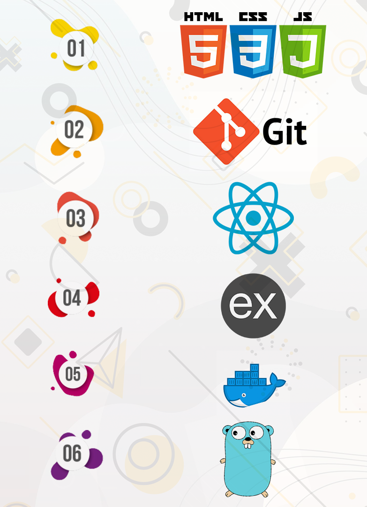

# Zero 2 Hero

## 1. [Git](./docs/git/git.md)

## 2. [VS Code](./docs/vscode.md)

__If you _know_ HTML, Bootstrap, Js__

## 3. [Node](./docs/node/node.md)

## 4. [React](./docs/node/react.md) / [Angular](./docs/node/angular.md)

### Why React?

Now, the main question arises in front of us is why one should use React. There are so many open-source platforms for making the front-end web application development easier. Let us take a quick look on the benefits of React over other competitive technologies or frameworks.

#### 1. Simplicity
 
The component-based approach, well-defined lifecycle, and use of just plain JavaScript make React very simple to learn, build a professional web (and mobile applications), and support it.
 
#### 2. Easy to learn
 
Anyone with a basic knowledge of CSS and HTML can easily understand React. 

#### 3. Native Approach
 
React can be used to create mobile applications (React Native). And React is a diehard fan of reusability, meaning extensive code reusability is supported. So at the same time, we can make IOS, Android and Web applications.
 
#### 4. Data Binding
 
React uses one-way data binding and an application architecture called Flux controls the flow of data to components through one control point – the dispatcher. It's easier to debug self-contained components of large ReactJS apps.
 
#### 5. Performance
 
React does not offer any concept of a built-in container for dependency. You can use Browserify, Require JS, EcmaScript 6 modules which we can use via Babel, ReactJS-di to inject dependencies automatically.
 
#### 6. Testability
 
One of the things that make React so great is how convenient it is to test React-based apps. React views can be treated as functions of the state. As a result, React developers can work closely with testing engineers to manipulate any states moved across React View

### Why Angular?

Angular is an open-source front-end framework developed by Google for creating dynamic, modern web apps.

#### 1.Supported by Google

Google is one of the biggest firms in technology and the talented pool of Google developers are offering Long-Term Support (LTS) for Angular to up-scale enterprise Angular applications development.
Declarative UI
The Angular framework leverages HTML. HTML is also a declarative and intuitive language.

#### 2.POJO

With Angular, you don’t need any additional getter and setter functions. Since, every object it uses is POJO (Plain Old JavaScript Object), which enables object manipulation by providing all the conventional JavaScript functionalities. You can remove or add properties from the objects, while also looping over these objects when required.

#### 3.Reusability

The component-based structure of Angular makes the components highly reusable across the app. You can build the UI (User Interface) with moving parts, while also ensuring a smooth development process for developers.

 #### 4.Automatic synchronization with two-way data binding

Unlike some of the other frameworks that offer one-way data binding, the Angular framework provides two-way data binding. It seamlessly synchronizes the data between Model as well as View. Hence, when data is modified or changed, these two components get updated automatically in real-time.

Other advantages of the Angular framework are easy to access information, greater data security, ease of maintenance and easy testing and code consistency.

__If you _don't know_ HTML, Bootstrap, Js__

- [HTML Tutorial](https://www.w3schools.com/html/)  
- [Bootstrap 4 Tutorial](https://www.w3schools.com/bootstrap4/)  
- [JavaScript Tutorial](https://www.w3schools.com/js/DEFAULT.asp)  
