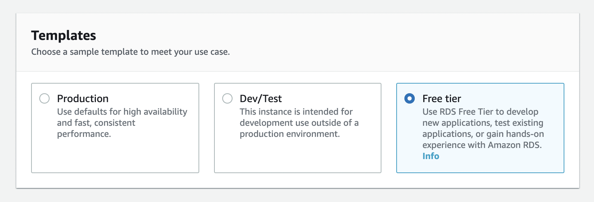

# Launch MySQL Instance on RDS  {#intro}

**RDS** is Relation Database Service running on **AWS**. It has a lot of advanced features such as **Backup**, **Snapshots** and **Multi AZ Replication**. In this document, We will have a look a MySQL Database Instance on AWS RDS.

## 1. Navigate to RDS {#navigate-to-rds}

First of you should log into the **AWS Account** and navigate **RDS** page. Then just click on **Create Database** in the top right corner.


## 2. Choose The Engine {#choose-the-engine}

Once you open the create database window, You need to select the Database Engine. **RDS** supports 6 database engines.

- **Amazon Aurora** - High performance `MySQL` / `Postgress` compatible database engine.
- **MySQL** - Standard MySQL database engine (Community Edition).
- **MariaDB** - Standard MariaDB database engine (Community Edition).
- **PostgreSQL** - Standard PosgreSQL ORDMS engine.
- **Oracle** - Multi Edition compatible Oracle database engine.
- **SQL Server** - Microsft SQL Server (2012, 2014, 2016, and 2017).

In our case, We need **MySQL**


## 3. Select The Template {#select-the-template}

Templates are just preset configurations that will be applied to rest of the section. But still you can customize it. There are 3 templates.

- **Production** - Configurations for highly available production workload database.
- **Dev/Test** - Configurations for testing or development purpose.
- **Free Tier** - Cost and performance optimized low level limited configurations for **AWS Free Tier**.



## 4. Setup Identifier & Credentials {#set-identifier-and-credentials}

This section has the settings for the instance credentials.

- **DB Instance Identifier** - It's just the name of the instance. Will be shown in RDS page.
- **Master Username** - It's the username of MySQL `Root` account.
- **Master Password** - It's the password of MySQL `Root` account.


## 5. Select The DB Instance Class {#select-instance-class}

In **AWS** instances are classfied based on **vCPUs**, **Memory** and other factors. You need to choose the correct instance type that suits to your requirement.

[Checkout all the AWS RDS Instance types here](https://aws.amazon.com/rds/instance-types/)


## 6. Choose The Storage {#choose-the-storage}

Once you selected the instance class, You need to choose the **Storage Type**, **Capacity** and **Autoscale** options.

- **Storage Type** - Type of the disk. There are 3 options `General Purpose (SSD)`, `Provisioned IOPS (SSD)` and `Magnetic`.
- **Allocated Storage** -  Capicity of the disk in **GiB**
- **Storage Autoscaling** -  If the instance running out of storage, It will automatically scale up the capacity.
- **Maximum Storage Threshold** - Maximum storage threshold required by planned workload of the DB.


## 7. Setup Availability & Durability {#set-availability-durability}

This option is important to production databases to increase the availability.

- **Create a Standby Instance** - Will replicate database across `Multiple Availability Zones`.


## 8. Configure Instance Connectivity {#configure-instance-connectivity}

In this section you need to configure the network of your instance. By default the RDS instance will be created in the `Default VPC`.

- **Virtual private cloud (VPC)** - The `VPC` where you need to create the instance. Instead of default, You can create new `VPC`.
- **Subnet Group** - The `Subnet` in `VPC` where you want to place this instance. Default `VPC` will have default `Subnet`.
- **Public Access** - If you enable this, The instance can be accessed from the outside of the `VPC`. Otherwise, The instances inside the `VPC` can access the instance.
- **VPC Security Group** - This controls the `Incomming Traffic` of the `VPC`. You can use default one or you can create new.
- **Availability Zone** - The `AZ` where you want to place the instance. `AZ`s are based on `Regions`.


## 9. Save & Launch The Instance {#launch-the-instance}

Once you configure all the required settings. You can launch the database by clicking on **Create Database**. It may take few mins to be provisioned.

## 10. Connect The Database {#connect-the-database}

Once your database created. You can see a lot of information about the instance. In **Connectivity & Security** section you can find the **Endpoint** and **port** to access your database.

Then you can connect your database through your **Application**, **MySQL Client** or **MySQL CLI**

```
>> mysql -u USERNAME -pPASSWORD -h ENDPOINT
```


