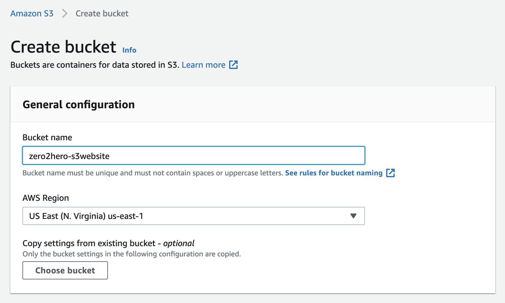
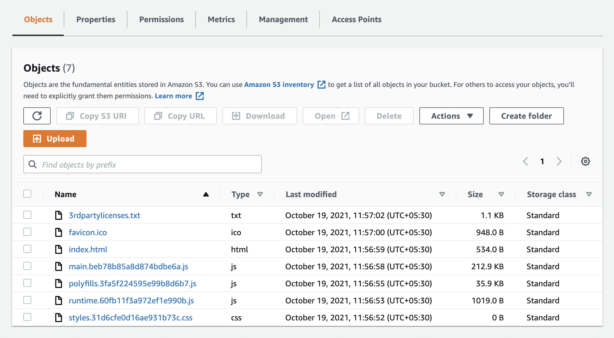
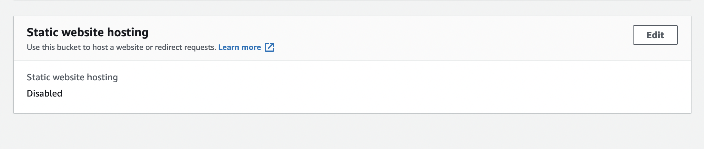
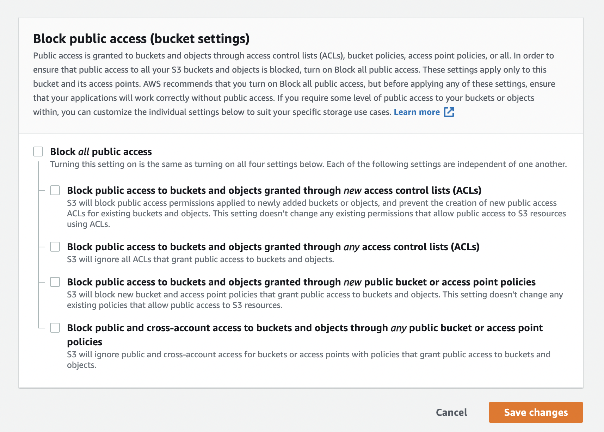
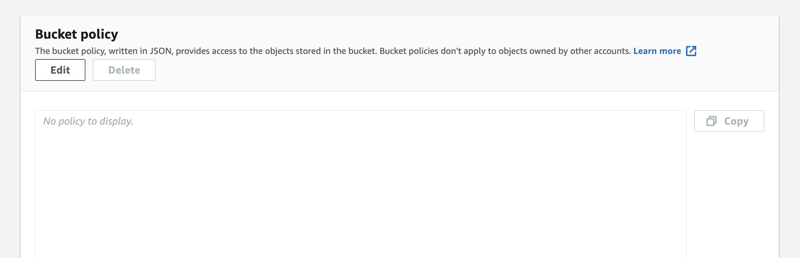
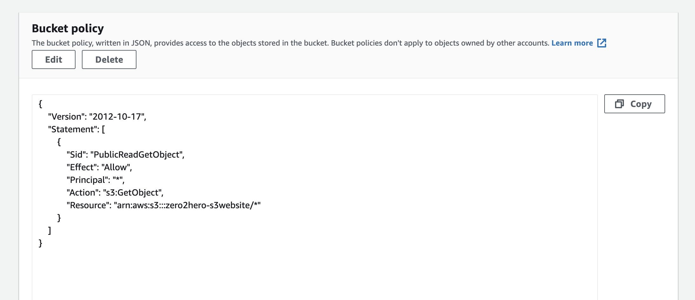
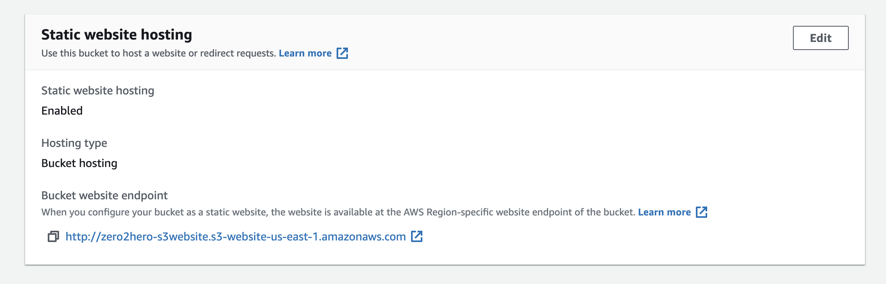
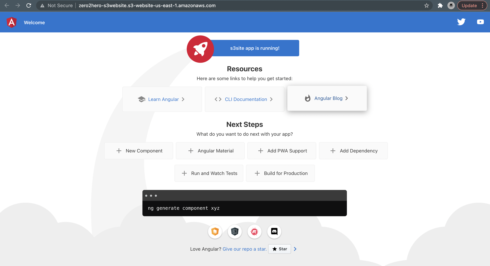

# Hosting Static Websites on S3  {#intro}

**S3** is an object storage service on **AWS**. It has a lot of advance features such as **Encryption**, **Versioing** and **Web Hosting**. In this document, We will have a look into hosting static websites on S3.

## 1. Create New S3 Bucket {#create-new-bucket}

First of you should log into the **AWS Account** and create new **S3 Bucket**. Just name your bucket and create it. You don't need to change any other settings for now.



## 2. Upload Website Files  {#upload-files}

Once you created your bucket, You need to upload all of your website files into the buckect.

> **Note:** The entrypoint (`index.html`) should be in the root of the bucket.



## 3. Enable Static-Web-Hosting  {#enable-static-web-hosting}

After uploading the files, You need to enable an option called **Static Web Hosting** that is located in **properties** tab.



Click on **Edit** button to **enable** it.


Make sure that you configured the options as follows,

 - **Static Web Hosting** - Enabled
 - **Hosting Type** - Host a static website
 - **Index Document** - index.html *(if you use different entry file, enter it)*

Once you set all above, **Save** it.

## 4. Change Bucket Permissions  {#change-bucket-permissions}

By default, **S3 Buckets** are **not public**. To make the website visible to users, You need to change the **permissions**. Follow below steps to do it.

1. Navigate to **Permissions** tab.
2. Scroll down to **Block public access** section.
3. Click on **Edit** and **Uncheck** all.
4. Then, **Save** the changes.



Once you done this, You need to define **Bucket Policy** to specify what kind of actions can be authorised to public.



Click on **Edit** and add following policy. Then, **Save** the changes. Replace `<<your-bucket-name>>` with your bucket name.

```json
{
    "Version": "2012-10-17",
    "Statement": [
        {
            "Sid": "PublicReadGetObject",
            "Effect": "Allow",
            "Principal": "*",
            "Action": "s3:GetObject",
            "Resource": "arn:aws:s3:::<<your-bucket-name>>/*"
        }
    ]
}
```

Once you done, It will look like this.



## 5. Visit Your Website   {#visit-website}

That's it, Now your website is public and anyone can access it. To get the **public url**, You should navigate to the **static web hosting** section. There you can see **Bucket website endpoint**.



Jusy **copy** and **paste** it on your browser. Now, You can see your website.

> *In this case, I deployed default angular app.*


