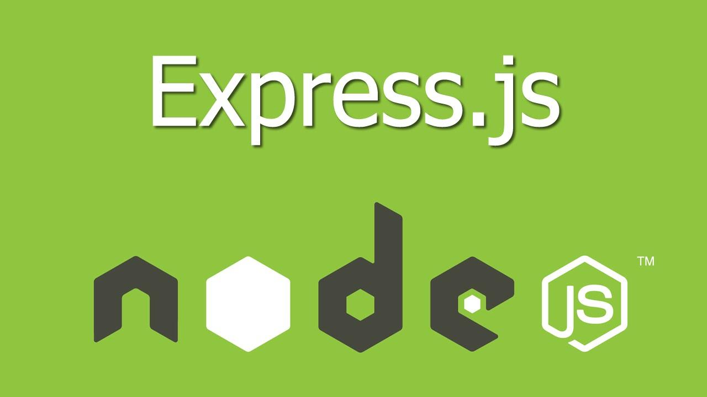
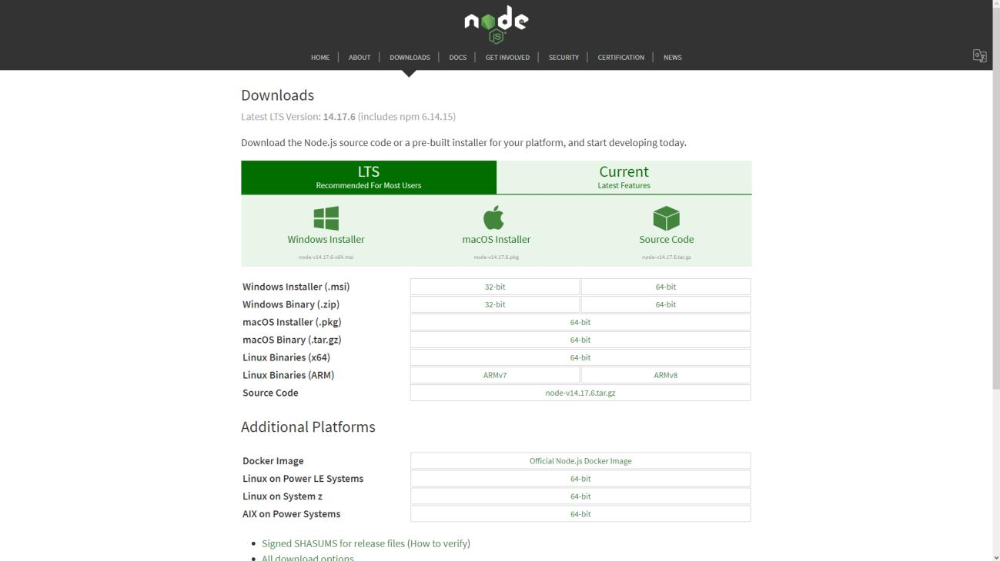
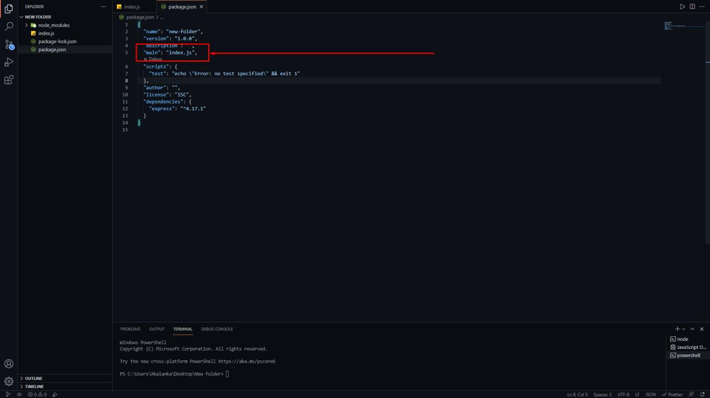
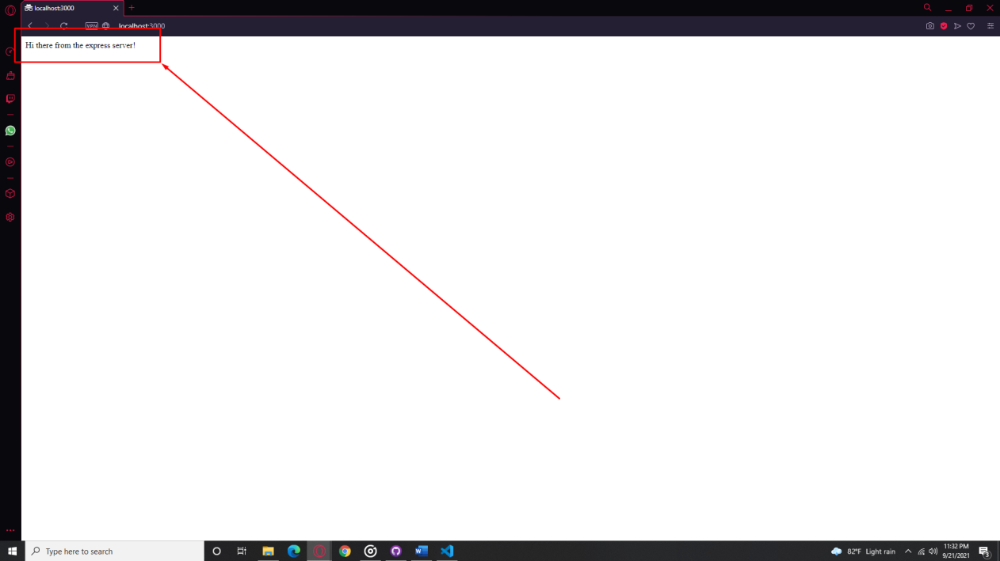

# Getting Started with Express



### What we will be covering

- What is Express?
- Installing Express
- Your very first Express server

## What is Express?

Express.js or commonly known as just Express is a Web Application framework built for
Nodejs. It was released on the 22nd of May 2010 as an open-source software under the MIT
license. As of today, it is one of the most widely used backend frameworks and is part of the
three popular JavaScript based technology stacks called MEAN, MERN and MEVN where M
stands for MongoDB, E stands for Express.js, N stands for Node.js and A, R and V stand for
Angular, React and Vue.js in their respective orders.

You can find the official documentation for Express at the link below,

[https://expressjs.com](https://expressjs.com)

## Installing Express

Installing Express, like any other node module, is exceptionally easy but you do need
Node.js pre-installed on your machine which is available to download at,

[https://nodejs.org/en/download/](https://nodejs.org/en/download/)

Any version of it is fine, as long as it is above v 0.10.0 which
is the minimum required to run Express.



Once node has been successfully installed, we will need to create a new directory from
which we can continue to work on out project. Navigate to a directory of your choosing and
execute the following commands in the terminal which will create a new folder called
expressApp, or alternatively you could use the standard GUI.

````bash
$ mkdir expressApp
$ cd expressApp
````

Since our project is ultimately a node.js application, we need a package.json file to hold
all important metadata related to our project. The following command will initiate a default
package.json file in the root directory of your project.

````bash
$ npm init
````

Once this is done, we are ready to add Express as a dependency to our project. You
could either install and add it permanently to your package.json file using, 

````bash
$ npm install express –save
````

Or install it temporarily without modifying your existing package.json file using,

````bash
$ npm install express --no-save
````

With this, we are finally ready to build our first Express server.

## Your very first Express server

Creating an Express app is easy as writing 7 lines of code. Hard to believe? Well, you’ll
see for yourself. To get started, we first need to create an index.js file in our root directory. The
name of this file can be changed into anything, but it needs to match what is specified over
here in your package.json file which by default, is set to index.js. This marks the entry point to
our application and even though our app will continue to function without it, it is good practice
to keep it defined.



In your newly created index.js file, we initially need to import express which can be
achieved through the following line of code.

````js
const express = require('express')
````

The variable ‘express’ seen above, which again can be anything you prefer is a function
and is the default export of express. We now need to call upon this function and assign the
express application to a variable which we generally do as follows,

````js
const app = express()
````

Next, we need to define a port on which our Express application will run. This can be
anything between port 0 and 65536 assuming that it is not in use by something else, but as a
normal most people prefer to use port 5000 while in development environments. Here we too
will be using port 5000.

````js
const port = 5000
````

The next step is to define a route to our application, which is basically a path through
which a client request arrives along with a specific HTTP request method. Our route should
define the course of action to take once such a request arrives. The syntax to achieve this is as
simple as follows,

````js
app.METHOD(PATH, HANDLER)
````

Where:
- app is the variable which we defined earlier
- METHOD is the HTTP request method which can be any of the following, GET, POST, PUT, or DELETE
- PATH is the route to our server to access this particular endpoint
- HANDLER is the callback function to be executed upon the arrival of a request through the above route

In our application, we will define a simple GET method to the root path of our server
upon which it will send us a simple response saying, “Hi there from the express server!”. We
can accomplish this as follows,

````js
app.get('/', (req, res) => res.send('Hi there from the express server!'))
````

The req and res you see above are special objects where req holds information about
the incoming HTTP request and res is used to send back the required HTTP response to the
client.

We are now almost at the end of our goal and all that is left is to tell the server to start
listening to incoming connections on the port we previously defined. We can do this by using
the app.listen() function of Express which expects a port number as the first argument and a
callback function as the second which specifies the action to be performed once the server is up
and running.

````js
app.listen(port, () => console.log(`Express app listening at http://localhost:${port}`))
````

Finally, to spin up our brand-new server, we need to execute the following line in our
terminal from the root directory of our project.

````bash
$ node index.js
````

To see our server in action, open up your browser and navigate to
[http://localhost:5000/](http://localhost:5000/) and voila, there you have the response from your very first Express
server!



That marks the end of our very first Express tutorial. 

We hope that you found it helpful...