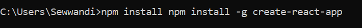
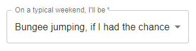
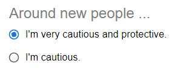
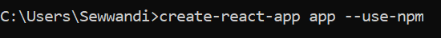
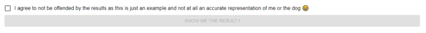
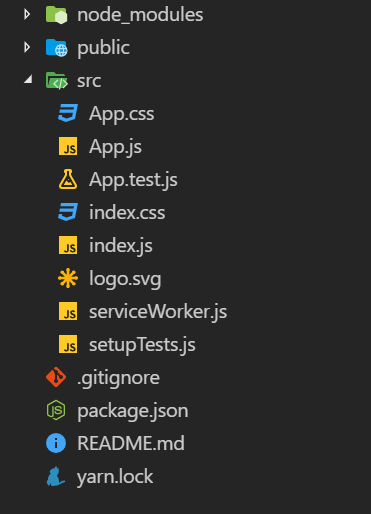
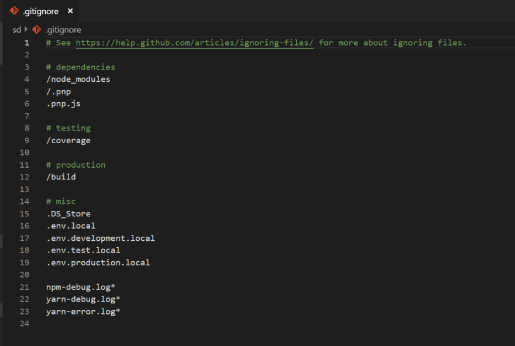
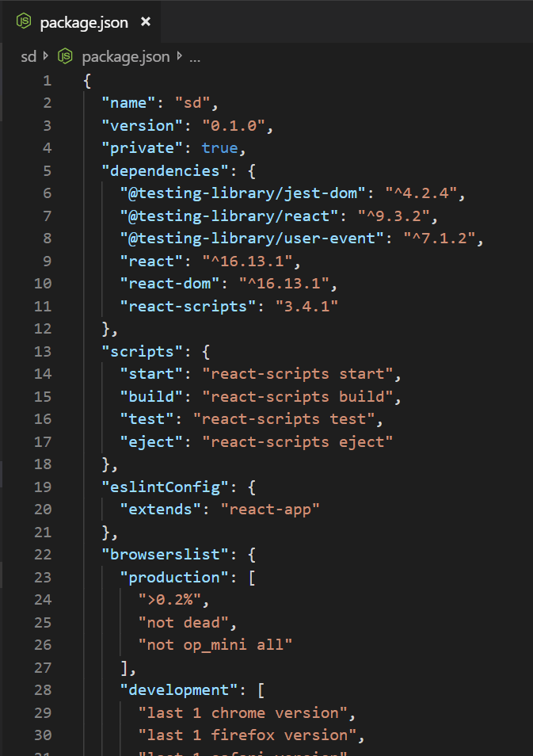

# Getting started with create react app

## What is React?

React.js is one of the most popular front-end library nowadays, developed by Facebook. It is not a complete application framework like Angular, It is simply a layer of view. After the theory is learned, the time comes to begin operation, and then it may seem a little challenging to start, locate and show details. But it doesn't have to be that difficult to build the first React.js project. In this article I will show you how to easily implement and run your React projects with create react app.

We're going to use the Node Package Manager (npm), so you will need Node installed.

## 1.Install create-react-app

First, we need to install the global(-g) package.
Open your terminal or console and run:

`npm install -g create-react-app`



After the process finished successfully, let's create our app.

## 2.Creating an App

Run the following command with a name you would like to use for your project. No capitals :)

`create-react-app app`



Running the command installs the required dependencies to create your project.



Then run `npm start` to starts the development server and auto-reloads the page any time when you make edits.

You may also use yarn.

If you prefer npm, but Yarn is used automatically,

try

`create-react-app app --use-npm`



## 3.Start the application

Let’s start our React app with the following commands:

```bash
cd app
npm start
```

The browser window will appear at the right address(localhost:3000) once the app is running, and you will see the following image in the browser.



## 4.React app structure

Now lets take a look around the app structure and see what it contains.

Once you open the project you can see the following structure.



Create-react-app took care to set up the application's main structure. The majority of what you see isn't going to be visible to your web app visitor.

### .gitignore

This is the basic file used to decide which files and directories to ignore when committing code by the source control tool git. Ignored files are generated by artifacts and machine generated files that can be retrieved from the root of your repository or can not be committed otherwise. If you look at the file, it took care to ignore a number of items.



### package.json

All npm packages contain a file, usually in the project root, called package.json
This file contains the metadata that relevant to the project.



- `name` is the name of your app

- `version` is the current version

- `"private": true` is a fail-safe setting to keep the software from unintentionally being released as a public bundle inside the npm ecosystem.

- `dependencies` contains all the required node modules and versions related to the application. This field is used to list all the dependencies of your project that are available on npm. When someone installs your project through npm, all the dependencies listed will be installed as well. Additionally, if someone runs npm install in the root directory of your project, it will install all the dependencies to ./node_modules.

- `scripts specifies` keywords that you can use to more easily trigger any of the react-scripts commands.

### node_modules

Its directory includes the dependencies and sub-dependencies of packages used by the current react application as described by package.json file. This contains more than 800 folders. For good reason, this folder is attached automatically to the .gitignore. Even with all those dependencies, after being compressed for output, the simple app would only be about 50 KB.

### package-lock.json

For operations where npm updates either the node module tree or package.json, package-lock.json is automatically created.This file contains the exact dependency tree installed in node_modules. This helps teams operating on private projects to ensure their dependence and sub-dependency are in the same version.

### public

This directory contains assets. index.html provides the entry point for the web app. The manifest file determines the behavior of your web app if connected to the home screen of an android user.

### src

This contains the JavaScript that will be processed by webpack. You can see the main App JavaScript component (App.js), its associated styles (App.css), and test suite (App.test.js). It is common to add components as the React application develops.


I hope you get the basic understanding on how to create a React application with installing create-react-app


