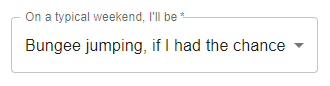
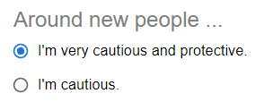
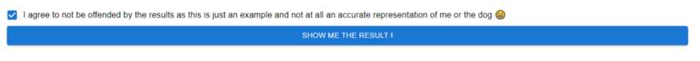
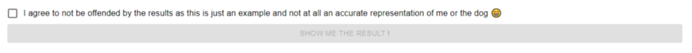
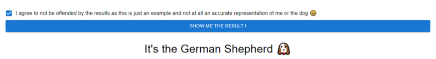

# Forms with React Hooks


## React Hooks

In a nutshell, React Hooks can be described as,

> Functions that let you “hook into” React state and lifecycle features from function components. — React

Introduced in React 16.8, a Hook (in React) is a function that keeps track of the state of a React functional component, and is used to solve the problem of only class components in React being able to access the state of the application before Hooks were introduced.

And state is how the dynamic data of a component is tracked by a component so that it can maintain the changes made to the component between renders.

So, to sum up, state stores the changing data of a component, and Hooks are used to manage that state.

This would mean that Hooks are essential for interactive components.

So let’s see how we could use React hooks to keep track of the changing state in a vital interactive web component, forms.

The form created will use components from [Material UI](https://mui.com/), and will take in user input in three ways, from a [select](https://mui.com/components/selects/), a group of [radio buttons](https://mui.com/components/radio-buttons/) and a [checkbox](https://mui.com/components/checkboxes/). And for the sake of an interesting example, we will be building a form that tries to match a breed of dog to a user’s personality. 🤭

## Handling form state

Handling a form’s state would mean specifying what will happen when a user changes an input field in the form, and keeping track of each change the user makes in the form.

## The Select component

To start, here’s the basic structure of Material UI’s Select component.

````js
<Select
    value={}
    onChange={}
    label="On a typical weekend, I'll be"
    labelId="select-outlined-label" 
>
    <MenuItem value={3}>Bungee jumping, if I had the chance</MenuItem>
    <MenuItem value={2}>Taking a calm walk</MenuItem>
    <MenuItem value={1}>Taking a well deserved nap</MenuItem>
</Select>
````

Each `<MenuItem>` tag denotes an item in the select’s drop down list. And the `value` property on the `<MenuItem>` tag holds the data that identifies each option. The `value` property of the `<Select>` tag will be the value of the option picked by the user, and will therefore be used to display the option picked by the user.

Therefore, the data in the `value` property of the `<Select>` tag is what should be tracked as state, since the user selecting an option is the dynamic (changing) aspect of this form input field. Which means a variable to hold state should be passed into the `value` property of the `<Select>` tag. 

And the `onChange` property defines what will be done when the Select input field is changed. In this case, we would want it to update the data stored in the `value` property of the `<Select>` tag.

## The useState Hook

The `useState()` Hook is used to create a state holder required by the Select.

````js
const [activeScore, setActiveScore] = useState(3)
````

To break down that statement,

The argument passed into `useState()` is what the initial value of the state holder created will be. In this case the initial value would be 3. This means that the Select will initially display the menu item with a `value` property of 3 (value={3}) as picked by the Select component.

`[activeScore, setActiveScore]` uses array de-structuring here. The `useState()` function returns an array of two items: the state holder and a reference to a function that is used to update the value held in the state holder. When array de-structuring is used here, the first element of the array returned (state holder) is stored in the variable `activeScore` and the second element of the array (a reference to update function) is stored in `setActiveScore`.

The variable names that are used when de-structuring the array could be anything, in this case they are named `activeScore` and `setActiveScore` to represent the state value they will be referring to, since the Select compo.

The previous code for Select had data for its `value` and `onChange` property missing.

````js
<Select
value={}
onChange={}
. . .
````

So, to pass the de-structured array to each prop, the `value` property will receive `activeScore` since it holds the value selected by the user for active score. To ensure that the `activeScor`e will preserve when the page re-renders, the `onChange` property will receive `setActiveScore` because each time the user changes the value of Select, the new value will have to be updated in the `activeScore` state holder, and `setActiveScore` contains the reference to the function that does that.

But each time the field is changed, an event object will be returned, which will contain the value of the `value` property of the `<MenuItem>` that the user has picked from the Select. This is the value that should be passed into `setActiveScore` and to extract this value, the `onChange` will be defined as 
```js
(e) => setActiveScore(e.target.value)
``` 
where `e` is the variable defined to store the event object received.

And the completed Select component with all its properties set to display and update the state, will look like this:

````js
<Select
    value={activeScore}
    onChange={(e) => setActiveScore(e.target.value)}
    label="On a typical weekend, I'll be"
    labelId="select-outlined-label"
>
    <MenuItem value={3}>Bungee jumping, if I had the chance</MenuItem>
    <MenuItem value={2}>Taking a calm walk</MenuItem>
    <MenuItem value={1}>Taking a well deserved nap</MenuItem>
</Select>
````

And the Select component rendered like this:

 

_The option to which `activeScore` is initialized to is displayed initially_

## The RadioGroup component

The RadioGroup component requires state management very similar to the Select component.

Since the radio group will get user’s input on a score on ‘alertness’, the state holder will be named `alertScore` and defined as;

````js
const [alertScore, setAlertScore] = useState(4);
````

And the RadioGroup component will make use of the state holder as;

````js
<RadioGroup
    value={alertScore}
    onChange={(e) => setAlertScore(e.target.value)}
>
    <FormControlLabel
        value={4}
        control={<Radio size="small" color="primary"/>}
        label="I'm very cautious and protective."
    />
    /* More radio options */
</RadioGroup>
````

Each `<FormControlLabel>` tag is an option in the radio group and has a specific value. In this case, the radio group initially shows the `<FormControlLabel>` option with a value of 4 as being selected, since `alertScore` was initialized to 4.



## The Checkbox component

The only difference in this component is that it simply stores a Boolean value, therefore its state will be initialized to a true or false value unlike the previous state holders which were initialized by numbers.

````js
const [agree, setAgree] = useState(false);
````

And used in the Checkbox component in the following way;

````js
<FormControlLabel
    label={
        "I agree to not be offended by the results as this is just an " +
        "example and not at all an accurate representation of me or the dog 😁"
    }
    control={
        <Checkbox
            checked={agree}
            onChange={(e) => setAgree(e.target.checked)}
            color="primary"
        />
    }
/>
````

To demonstrate how state is dynamically updated, let’s enable the submit button only when the checkbox is checked.





This can be done easily by passing the `agree` state holder manipulated by the checkbox to the `disabled` property of the Button component. When `agree` is true, `disabled` should be false. the logical NOT operator ! is used with agree to get the logical complement (the opposite Boolean value) of `agree`.

````js
<Button
disabled={!agree}
variant="contained"
color="primary"
onClick={displayResults}/* displayResults is the function that determines the result from the user input */
>
Show me the result !
</Button>
````

Now with our form in place, we will be moving to the final piece of the page, the result display.



The component is nothing more than text below the button, but it will have to display a different result for each different combination of answers according to the displayResults function. Sounds familiar? Yup, we will be tracking state here as well.

First the state holder for the result, with the initial result set to nothing:

````js
const [result, setResult] = useState("");
````

Next, a [Typography](https://mui.com/components/typography/) component to show the result and update each time result changes.

````js
<Typography variant="h4">
    {
        result ? `It's the ${result}` : ``
    }
</Typography>
````

The ternary operator (`<variable> ? <if true> : <if false>`) used here says that if `result` is true, the sentence is shown, else an empty string is visible. The sentence itself is a template literal that displays the value stored inside `result` with `${result}`.

When the submit button is clicked, the `displayResults` function is called, and it changes `result` each time, by calling `setResult` within `displayResults`.

The `displayResults` function of this example is just a function that categorizes a user to a personality based on the scores chosen and can be replaced by any function that processes form data.

Hope this example helped shed some light on React Hooks and how they are used in interactive web components.

Happy coding!

