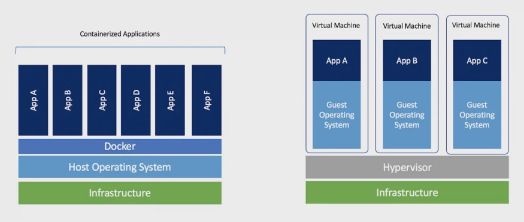
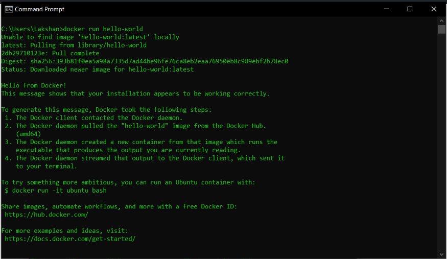
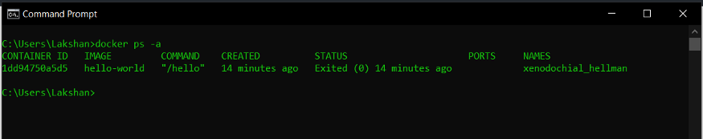
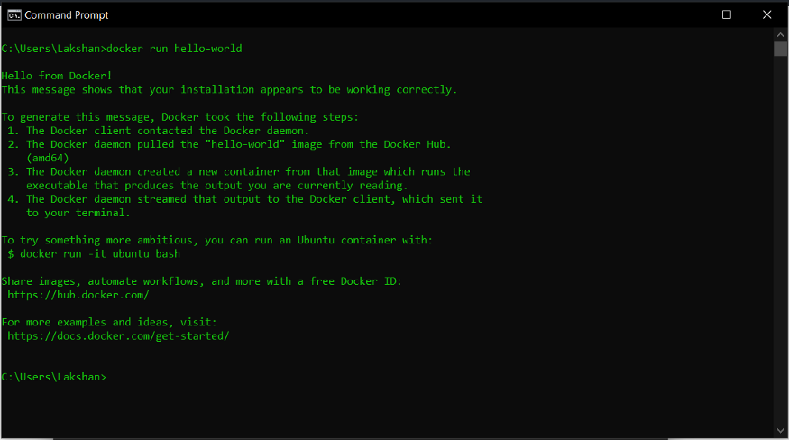
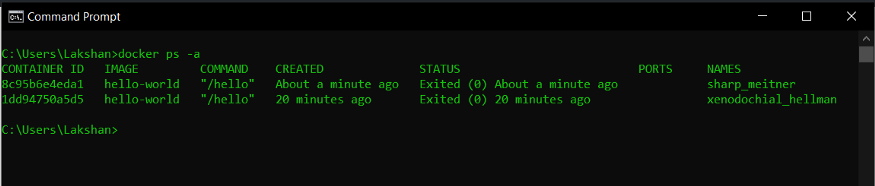
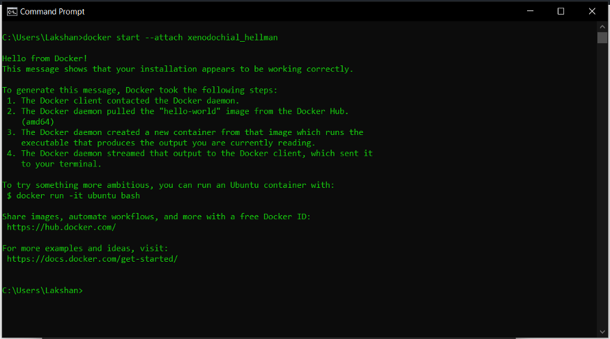
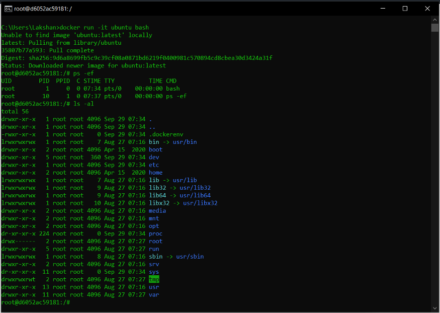
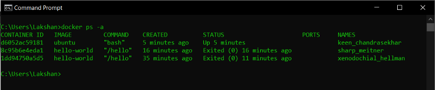
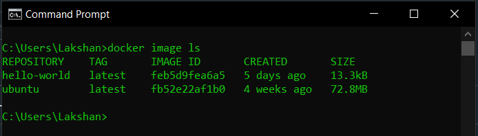

# Docker Orientation and Setup

Docker is a platform for packaging, deploying, and running applications. Docker applications run in containers that can be used on any system: a developer’s laptop, systems on premises, or in the cloud.

## Container VS Virtual Machine

- **Containers** : Containers are an abstraction at the app layer that packages code and dependencies together. Multiple containers can run on the same machine and share the OS kernel with other containers, each running as isolated processes in user space.

- **Virtual machines** : Virtual machines (VMs) are an abstraction of physical hardware turning one server onto many servers. The hypervisor allows multiple VMs to run on a single machine. Each VM includes a full copy of an operating system, the application, necessary binaries and libraries — taking up tens of GBs. VMs can also be slow to boot.



Benefits of using Docker
- Run container in seconds instead of minutes
- Less resources results less disk space
- Uses less Memory
- Does not need full OS
- Deployment
- Testing

## What is a container image?

When running a container, it uses an isolated filesystem. This custom filesystem is provided by a container image. Since the image contains the container’s filesystem, it must contain everything needed to run an application — all dependencies, configuration, scripts, binaries, etc. The image also contains other configuration for the container, such as environment variables, a default command to run, and other metadata.

## Get Started with Docker

You can download and install Docker on multiple platforms.

- [Docker Desktop for Mac](https://docs.docker.com/desktop/mac/install/)
- [Docker Desktop for Windows](https://docs.docker.com/desktop/windows/install/)
- [Docker for Linux](https://docs.docker.com/engine/install/)

Download the correct installer for your operating system and run the installation.

## Running a container

Once we install the tools, we can run a Docker image:



````bash
docker run hello-world
```` 

does exactly what it sounds like. It runs an image named “hello-world.”

Docker looks for this image on our local system. When it can’t find the image, Docker downloads it from [Docker Hub](https://hub.docker.com/) for us.

Hello-world displays a message telling us everything’s working. Then it spells out the process for us before recommending some additional steps.

## Under the covers

Let’s take a look at a few more Docker commands that tell us more about the environment.

````bash
docker ps -a
````

lists the containers on our system:



From this, we can see that the hello-world container is still in memory. The status column tells us that it’s exited. The **names** column has a name, **xenodochial_hellman**, that Docker assigned to the container for us.

Let’s run this image again with

````bash
docker run hello-world
````

The output is almost the same…



…except this time we don’t see information about downloading the image. It was already available on our system.

But what does `docker ps -a` show us now?



We see two stopped instances of hello-world, with two different names. Docker created an additional container. It didn't reuse the first. When we told Docker to run an image named hello-world, it did exactly that; it ran a new instance of the image. If we want to reuse a container, we refer to it by name.

## Reuse a container

Let’s try starting one of the stopped containers:



This time, we used 

````bash
docker start –attach <container name> 
````

instead of docker run. We use the `start` command, and rather than naming the image, we specify the name of a container that’s already loaded. The `–attach` tells Docker to connect to the container output, so we can see the results.

We stop containers with 

````bash
docker stop <container name> 
````

and remove them with 

````bash
docker rm <container name>
````

If we check `docker ps` again, we still see two containers.

Let’s run a container that doesn't exit immediately. Hello-world’s instructions gave us an interesting example:



With a single Docker command, 

````bash
docker run -it ubuntu bash 
````

we downloaded an Ubuntu Linux image and started a login shell as root inside it. The `-it` flags allow us to interact with the shell.

When we open another window and list containers, we see a different picture:



The Ubuntu container’s status is `Up`. Let’s see what’s going on inside:

`docker top` looks inside the container and shows us the running processes. The Ubuntu container is running a single process — the root shell.

`docker image ls` produces a listing of images on our system. We see Ubuntu and the single hello-world image since we only needed that single image to run two containers.



That’s all for today, hope it helps in your developer journey.