# Git

Create a GitHub Account: https://github.com

## Installation

Windows : https://git-scm.com/downloads <br>
Mac : https://gist.github.com/derhuerst/1b15ff4652a867391f03#file-mac-md <br>
Linux: https://gist.github.com/derhuerst/1b15ff4652a867391f03#file-linux-md <br>

### Setting up on Windows

#### 1) Downloading the Executable

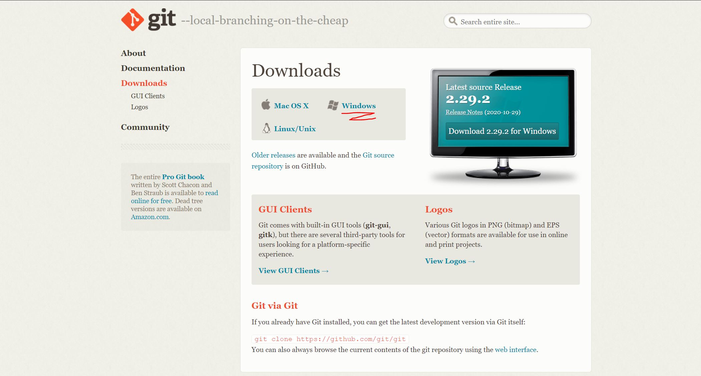<br/>
<small>Just bash the Next button and you should be good, the git installer already has the recommended settings ticked (Hopefully)</small>

#### 2) Initialization

Go to your ```
C:/users/{whatever-your-username-is}``` <br />
<small>Or really wherever you want to :/ </small><br/><br />
Right Click and you should see this: <br /> <br />
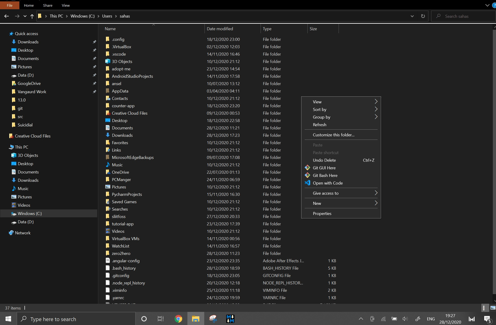 <br />
Now if everything worked out quite well, you should see the Git Bash option, if it didn't you'd need some additional help so inquire someone who knows what they're talking about or start surfing the interwebs for your answer. :surfer:<br /> <br />

Open up Git Bash by clicking on it and you should see this particular looking command prompt imposter: <br /><br />
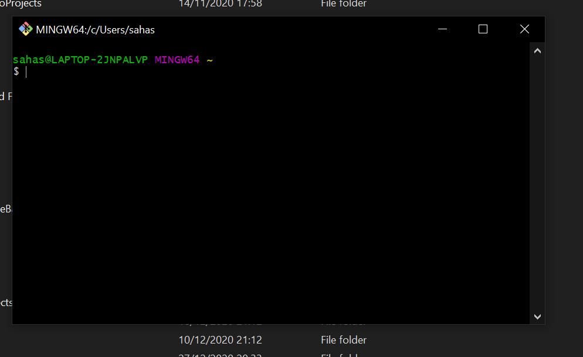

Type in these commands to setup the username: <br/>
```git config --global user.name "{your-username}"``` <br />
<small>(For very obvious reasons I don't need to say outloud you should substitute {your-username} for your username)</small>

Type in these commands to setup the email id: <br/>
```git config --global user.email "{your-email}"``` <br />
<small>(Use the email you used to register your GitHub account)</small>

Now there are other tricks and tips you can do to setup your environment in a million ways like change your ui color but that won't be written here, here's a cheat sheet if you like that sort of thing: https://training.github.com/downloads/github-git-cheat-sheet/

<small>There's really two ways you can go from here on out, if you want to create your own repo from the get-go (3a) or if you want to clone another person's work and work on top of it (3b) if you want to learn how to add files and directly commit and push skip both parts of 3.</small>

#### 3a) Creating a repository from scratch

1. Create new folder - <small>Fairly obvious, wherever you want it to be, whatever you want to call it </small>
2. Create a html file inside in the folder - <small>Let's call it index.html, but it really could be anything but for ease of understanding we'll go with this, if these two simple steps went alright you'll have something like this:<br/><br/> </small> 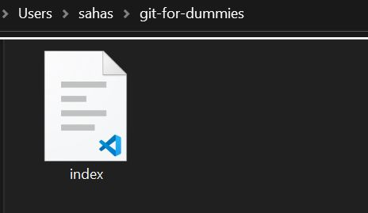
3. Let's add some dummy "code" (If you can call HTML5 code that is) to it.
4. Now Right Click inside the folder and click on Git Bash.
5. It should look like this, and you should see the folder name with ~/ <br/><br/>  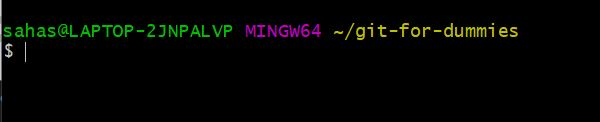
6. Type in the command:<br /> ```git init``` <br /> What this does is that it initializes a GitHub Repository on your local machine. If everything went alright you should get something similar to this: <br/> ```Initialized empty Git repository in C:/Users/sahas/git-for-dummies/.git/ ```
7. A new file should have popped up with the .git extension, if you can't see it try turning on your **Reveal hidden files** option on in View <br /> <br /> 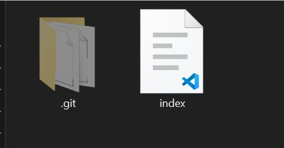 <br /> <br />
<small>Now you're probably thinking: *"Well this is all amazing and all but how do I put these stuff on the actual Github.com website so I can show off my work to everyone"* Well let's get right to it.</small>
8. Setting up a Repo on GitHub.com: <br /> <br />
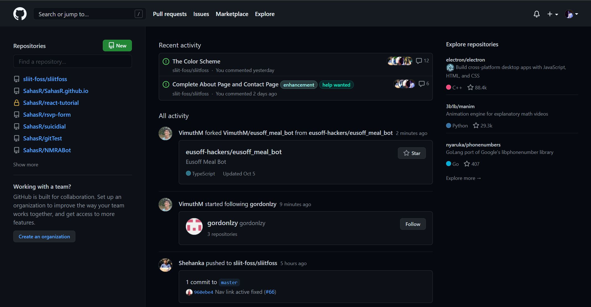 <br />
On the top right hand side once you open up GitHub.com and log in is a plus button next to your profile image. Click that and click on the option **New repository**
9. Now you'll be presented with a few options: <br/>
**Add a Repository Name, you're not allowed to add spaces so make sure if its two words you add a "-"" or a "_", if you've used Instagram you'll be acquianted with this rule. :yum: I'll call mine **git-for-dummies**, it's also a generally good rule to have a tiny description so any outside (or yourself in six months time looking at this repo, forgetting its humble beginnings) would know what its about. You are again presented with a few options, but we'll ignore them for now. Click on **Create repository**.
10. This is what you should see: <br/> <br />  <br/> Now you might be thinking *Hey! Some of these commands looks familiar didn't we just type that* ```git init``` *command as well?* , and yes we did! Now you need to realize we have two different repositories, one on Github.com and one on your local machine. How do I turn them into one?
11. Copy paste the url that has shown up in the **Quick Setup** part of this Github.com webpage, mine is ```https://github.com/SahasR/git-for-dummies.git``` but yours is obviously different. Now let's go over to the Git Bash in your local repository. (Right click inside your root folder and open up GitBash)
12. Now let's type in this command <br/> ```git remote add origin {whatever you copied from the website}``` <br /> <small>Hint: Ctrl+V doesn't work inside the GitBash so just right click after you type the first bit and click on the Paste option</small> <br/>
Now both your local repo and online repo have been connected.</br></br>  <br />

#### 3b) Working on an already existing repository / Cloning

1. First go to which Repository you want to clone and work on, we'll use the initial one I just created for the ease of access before you clone its good practice to **Fork it** over to your account, by doing that you basically create a copy of the repository to your name which you have all the rights in the world to work with. So if you don't know what to Fork go to https://github.com/SahasR/git-for-dummies and click on the **Fork**. <br/> If you're having trouble finding it, it's on the top right hand side of the page. The procedure to fork it is fairly straightforward. 
2. After that you should see a page that is identical to what you started with but if you look at the top left handside of the page you will see ```{Your username}/git-for-dummies```. This means you have created an identical version of the repo under your name. 
3. Now to **Clone** it and work with it in your local machine click on the Green button as shown and copy the given link </br><br/> 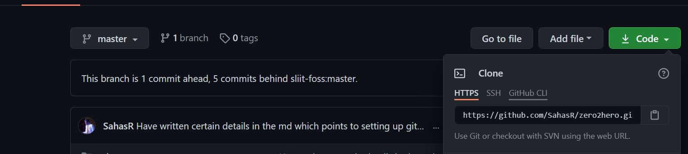
4. Go to the location you would want the end folder to be and open up Git Bash (Right Click if you've forgotten :p ) and type in the command: </br> ```git clone {whatever-you-copied earlier}``` the end result should look like this: <small>The warning might have gone since I would have added some stuff later.</small> 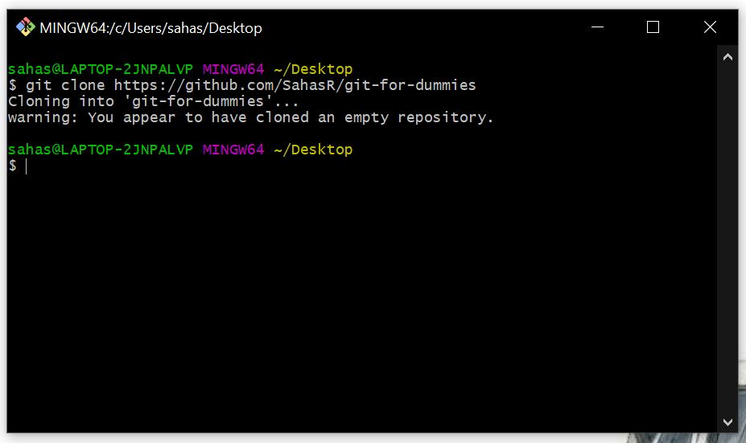
5. There should be a new folder opened up with your repo name on it like this. </br> 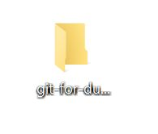
6. Now you've succesfully cloned a repo and we'll create an index.html file in it with some simple html tags like this: <br/><br/>
7. If you type the command ```git remote -v``` you'll also be able to see that that your local repo that you cloned from is already connected up with the one you got down from Github. Likewise: <br/><br/>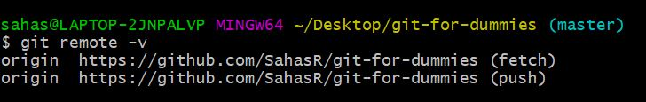

#### 4) Commiting

1. Now that you've created a local repo/ cloned one and have made some changes you'll do what everyone needs doing which is to stage the changes you made. Here's how that goes. 
2. Once you've made the changes, (in our case add an html file) we need to tell our local repo *"Hey look we've added these files and we want you to know about it"* by using the command: ```git add {whatever-new-file-you-just-added.html}``` obviously this gets tiresome if you add a bunch of files because you can't possibly list them all out right? So we use the command ```git add .``` where the '.' means everything. 
3. You wouldn't see anything as it would just quitely add everything so do a quick ```git status``` to see what's going on. Here's what that looks: </br></br> <br/> <small>As you can see git has recognized that we have added a new file.</small>
4. These are what you call "Unstaged Changes" if we want them to be "Staged Changes" we need to do the party trick, which is to commit. Do so by typing: </br> </br> ```git commit -m "Added a new file"``` </br></br> "-m" signifies the "Commit Message", you can really add whatever you want as a Commit Message but its best practice to make it meaningful. Since our only change is adding a new file, I have said so in the Commit Message.</br></br>   <br/> <small>This is what it should resemble.</small>
5. We're not done yet! Although we've made a commit in our local repository nothing has updated in our GitHub repository. So we should use the command: </br> ```git push -u origin master``` 
</br> You only need to add the **-u** the first ever time you do a Github Repository push so afterwards you won't need to use it. It should look like this: </br> </br>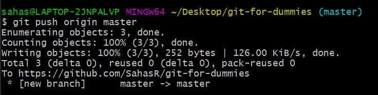
6. Now if you rush over to your Repository on Github it should look like this: </br></br>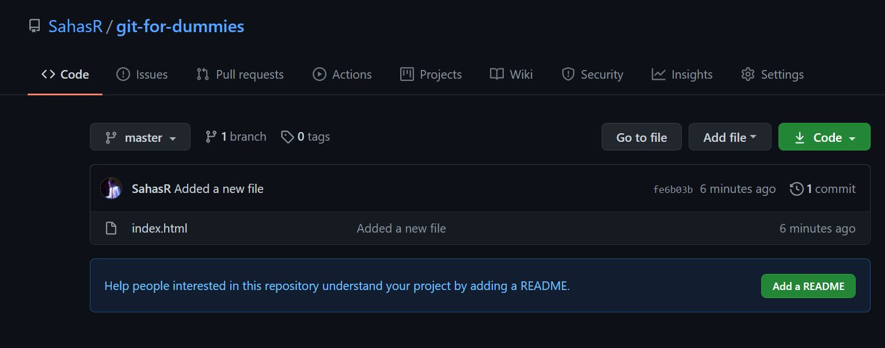 you will see that you have added a new file.

#### 5) Finale!

Now you've learnt how to setup a local repo,  connect your GitHub repo to your local repo, do your first commit, and push the changes! That's basically all of what you need to know in the beginning to get you started. Looking forward to seeing your work being published on Github! </br> </br>


## Workflow

Git Workflow : https://www.atlassian.com/git/tutorials/comparing-workflows <br>
GitHub, Workflow : https://guides.github.com/introduction/flow/ <br>

## Hello World

GitHub, Hello World : https://guides.github.com/activities/hello-world/ <br>
