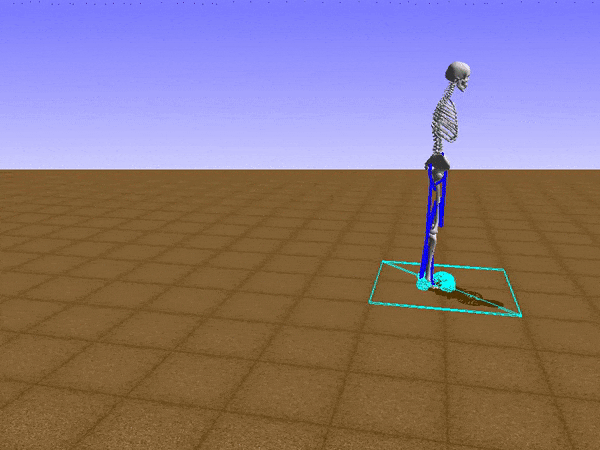

Different type of machine learning

- Supervised learning
- Unsupervised learning
- Reinforcement learning

## Supervised learning

In supervised learning first we give some raw information (Training data) to the machine learning model, and then it will make the rules for us.
This training dataset contain both Input data and correct Output data.

Then machine learning model will try to adjust its error to minimum amount, through loss function by increasing accuracy.

Later when we need to enter the input data it will give the output data we need.

so it like mapping input(x) to output(y).

`y = f(x)`

Supervised learning can be dived into two groups:
- Regression
- Classification

### **Regression**

By using regression we can predict the value of outputs based on the value of input.
So its like when we give both input and output data machine learning model will come with way to understand the relationship between
input and outputs or depended on variable and intended variable.

There are two terms we used in regression
Feature and labels.

- Feature is like inputs, which is data give when need to predict output.
- Labels are the output data which going predict from the model.

For example if we take a house price prediction, then feature are area of the house, location of the house and some others and labels is the price of the house which is the output we get.

(Note that there can either one or more labels. It is not limited to one)

Most commonly used regression algorithms are Linear regression, logistical regression, and polynomial regression.

### **Classification**

Classification is simply the process of finding the correct label for the input data.

For example , if we have a picture of a dog, and we want to know what kind of animal it is, we can use classification.
For do that we can prepare set of data of animals, then label them according to their name.
After that we can give these data to model, and it will make rules for us.
So once it finished, when we can show dog picture to model it can come up with prediction on what kind of animal it can be.

Mostly common used classification algorithm is linear classifiers, support vector machines (SVM), decision trees, k-nearest neighbor, and random forest

Let's talk about them in detail later.

Supervised learning is the most common type of machine learning. It has many uses cases.
So if we have both input and output data, we can get a good result using supervised learning.
But we don't have luck to having both type of data all the time. That's where unsupervised learn comes in.

## Unsupervised learning

In unsupervised learning when data is given, machine learning model comes up with ways group/cluster unlabeled data using algorithms.

Common approaches for unsupervised learning are clustering, dimensionality reduction, and data visualization.

Unsupervised learning can be used for,
- computer vision activities like image recognition
- News article categorizing
- Anomaly detection
- build customer persona profiles based on theory habits
- Recommendation Engines

Common Algorithms and techniques used in Supervised and Unsupervised learning.

## Reintegration learning

Reinforcement learning is the process of using a machine learning model to learn from experience.
So it doesn't have any input or output data, it just gives the model some reward or punishment.

Agent : The actor operated within the environment : The world which agent can operate
Action : The actions' agent can take
Reward and Observation: What agent receive and what agent can observe after that

In reinforcement learning, machine learning model face a game like situation. 
So it trys different actions (trial and error) to solve the problem and try to 
maximize the rewards. When it does that it will get some reward or punishment.

If the action helps to achieve the goal then it is rewarded if not it is vanished.

As the designer of the module we only give the set of reward policies. The rules for how to play the 
game (maximize rewards) is made by the machine learning model itself.

To get accurate result machine learning model will play this again and 
again and find new ways to get reward more efficiently.

Common Reinforcement learning Algorithms are:
- Q-learning
- Deep Q-learning
- SARSA (State-Action-Reward-State-Action)

Applications of Reinforcement learning:
- Autonomous Driving
- Simulated Training of Robots
- Play games like chess, checkers.
- Reinforcement learning can be used to improve the performance of a machine learning model.
- AlphaGoZero ([https://deepmind.com/blog/article/alphago-zero-starting-scratch](https://deepmind.com/blog/article/alphago-zero-starting-scratch))

- Running Man
In this project they build this man from scratch giving the data about how the bones works.
His task was to find a way to run. So he trys move from some random moves and later figure out way to jump.

But his goal was not to jump. So they did some adjustments and give him the idea about moving his legs separately.

So after more and more trials he able do this.

Sound fun right. But why not we create some by our own. In next articles let's see how we can do similar small projects.
