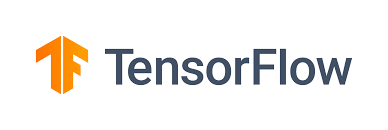

# Tensorflow

TensorFlow is Google’s open source AI framework for machine learning and high performance numerical computation. And it is the most popular one out there.
Tensorflow includes many packages and tools such as tensorboard, colab, and the What-If tool.



There are manly two method you can use tensorflow:
1. Installing locally in anaconda and use with jupyter notebook ([https://www.tensorflow.org/install](https://www.tensorflow.org/install))
2. Use google colab ([https://colab.research.google.com/notebooks/welcome.ipynb](https://colab.research.google.com/notebooks/welcome.ipynb))

Tensorflow can be either run on CPU or GPU. But if you can it is recommended to run on GPU. Otherwise, training and Evaluations will be slow. Sometimes using GPU can be speed upto 30 - 40 times. So you can understand the difference.

TensorFlow also have two version for Javascript and Mobile which is TensorFlow.js for Javascript and TensorFlow lite for Mobile.


## what is Tensorflow

Tensorflow is open source machine learning platform.

what can we do with it?
- Image classification
- Regression
- Clustering
- Reinforcement learning
- Natural language processing
- Neural networks
- Deep learning

And list goes on and on.

## How tesnorflow works

Tensorflow has two main component that we need to undestand first before move on.

- Graphs
- Sessions

TensorFlow has a graph that is the main structure of the model. In graph nothing is stored or computed.
For exapmle of we add a varible and say you need to sum this up with another one. What graph do is it stores the operation.

What is tensor?

Tensors are simply mathematical objects that can be used to describe physical properties.
So they are basically like vectors and scalers.

In tensorflow tensors are work like Tensors are multi-dimensional arrays with a uniform type (called a dtype)
If you familiar with numpy tesnor are like np.array (numpy array)

Tensors are ranked base on the shape.

- scalar or rank-0 tensor . A scalar contains a single value, and no axes
- A vector or rank-1 tensor is like a list of values.
- A matrix or rank-2 tensor has two axes


## Code Tensors

First we need to import tf and np
`````py
# Tensors

import tensorflow as tf
import numpy as np
`````

### Rank 0 / Scale Tensor
`````py
rank0_tensor = tf.constant(4)
print(rank0_tensor)
`````

This will output `tf.Tensor(4, shape=(), dtype=int32)`

So you can see that its type is int32. So its simply a scaler and shape is () (like point)

### Rank 1 / Vector
