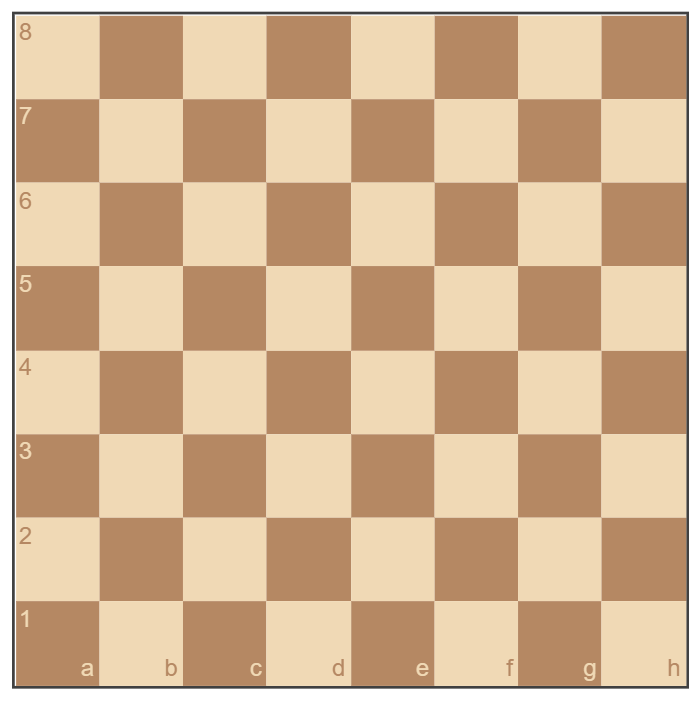
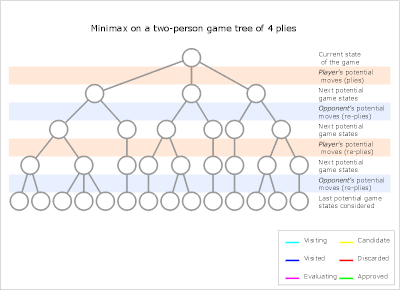

This project is made with [chess](https://github.com/jhlywa/chess.js) and [chesscoardjs](https://github.com/oakmac/chessboardjs/).

For AI, minimax algorithm and Piece-square tables are used.

You can view the final output in here, [https://timnirmal.github.io/Chess-AI/](https://timnirmal.github.io/Chess-AI/)

Code files Github : [https://github.com/timnirmal/Chess-AI](https://github.com/timnirmal/Chess-AI)

Each step can be found in respective commit,
- Initial commit - Basic Chess Board Setup files to start
- Allow only Legal Moves
- Simple Status
- Computer Play Random
- Computer Play Random both side
- Highlight Legal Moves
- AI Done (Minimax with Alpha Beta)

So that's about the introduction. Lets begging Project.

## Setup Chess Board

You can begin the work with the following files. So go there and start your journey.
[https://github.com/timnirmal/Chess-Board-Template.git](https://github.com/timnirmal/Chess-Board-Template.git) 

You might note that there are some empty functions, 

```js
onDragStart, onDrop, onSnapEnd, onMouseoverSquare, onMouseoutSquare
```

but you still need them to get output + we will use them later.

Now if you open the index.html You can see something like this.



Now We can use ```config``` to do the configurations.


Note that at this point it only show the Board and the Chess Pieces.


## Configurations

### Orientation

Orientation can be either white or black which is the side you play.

### Notation

Notation is boolean values which used to on and off board notation

### Show Positions and FEN in console

```html
<button id="showPositionBtn">Show position in console</button>
```

```js
$('#showPositionBtn').on('click', clickShowPositionBtn)

function clickShowPositionBtn () {
    console.log('Current position as an Object:')
    console.log(board.position())

    console.log('Current position as a FEN string:')
    console.log(board.fen())
}
```

After preparing board, and now we can make out AI.

## Preparing Evaluation Method

First we need to prepare evaluation method which will be used in algorithm. Evaluation is technique that let players or algorithm decide which side is better in particular position of the board. Based on these divisions paler can decide either attack or loose and what move to do.

[Evaluation](https://chessfox.com/example-of-the-complete-evaluation-process-of-chess-a-chess-position/) is kind of complex process, so we use a simple method for that using [piece-square tables.](https://www.chessprogramming.org/Simplified_Evaluation_Function)

### Pawns

```js
// pawn
 0,  0,  0,  0,  0,  0,  0,  0,
50, 50, 50, 50, 50, 50, 50, 50,
10, 10, 20, 30, 30, 20, 10, 10,
 5,  5, 10, 25, 25, 10,  5,  5,
 0,  0,  0, 20, 20,  0,  0,  0,
 5, -5,-10,  0,  0,-10, -5,  5,
 5, 10, 10,-20,-20, 10, 10,  5,
 0,  0,  0,  0,  0,  0,  0,  0
```

### Knight

```js
// knight
-50,-40,-30,-30,-30,-30,-40,-50,
-40,-20,  0,  0,  0,  0,-20,-40,
-30,  0, 10, 15, 15, 10,  0,-30,
-30,  5, 15, 20, 20, 15,  5,-30,
-30,  0, 15, 20, 20, 15,  0,-30,
-30,  5, 10, 15, 15, 10,  5,-30,
-40,-20,  0,  5,  5,  0,-20,-40,
-50,-40,-30,-30,-30,-30,-40,-50
```

### Bishop

```js
// bishop
-20,-10,-10,-10,-10,-10,-10,-20,
-10,  0,  0,  0,  0,  0,  0,-10,
-10,  0,  5, 10, 10,  5,  0,-10,
-10,  5,  5, 10, 10,  5,  5,-10,
-10,  0, 10, 10, 10, 10,  0,-10,
-10, 10, 10, 10, 10, 10, 10,-10,
-10,  5,  0,  0,  0,  0,  5,-10,
-20,-10,-10,-10,-10,-10,-10,-20,
```

### Rook

```js
//rook
  0,  0,  0,  0,  0,  0,  0,  0,
  5, 10, 10, 10, 10, 10, 10,  5,
 -5,  0,  0,  0,  0,  0,  0, -5,
 -5,  0,  0,  0,  0,  0,  0, -5,
 -5,  0,  0,  0,  0,  0,  0, -5,
 -5,  0,  0,  0,  0,  0,  0, -5,
 -5,  0,  0,  0,  0,  0,  0, -5,
  0,  0,  0,  5,  5,  0,  0,  0
```

### Queen

```js
//queen
-20,-10,-10, -5, -5,-10,-10,-20,
-10,  0,  0,  0,  0,  0,  0,-10,
-10,  0,  5,  5,  5,  5,  0,-10,
 -5,  0,  5,  5,  5,  5,  0, -5,
  0,  0,  5,  5,  5,  5,  0, -5,
-10,  5,  5,  5,  5,  5,  0,-10,
-10,  0,  5,  0,  0,  0,  0,-10,
-20,-10,-10, -5, -5,-10,-10,-20
```

### King

```js
//king middle game
-30,-40,-40,-50,-50,-40,-40,-30,
-30,-40,-40,-50,-50,-40,-40,-30,
-30,-40,-40,-50,-50,-40,-40,-30,
-30,-40,-40,-50,-50,-40,-40,-30,
-20,-30,-30,-40,-40,-30,-30,-20,
-10,-20,-20,-20,-20,-20,-20,-10,
 20, 20,  0,  0,  0,  0, 20, 20,
 20, 30, 10,  0,  0, 10, 30, 20
```

The middle game is defined since there is pawn shelter for king. When,

1. Both sides have no queens or
2. Every side which has a queen has additionally no other pieces or one minor piece maximum.

End game is defined. (But we only use middle game table for these steps.)

### King End Game

```js
// king end game
-50,-40,-30,-20,-20,-30,-40,-50,
-30,-20,-10,  0,  0,-10,-20,-30,
-30,-10, 20, 30, 30, 20,-10,-30,
-30,-10, 30, 40, 40, 30,-10,-30,
-30,-10, 30, 40, 40, 30,-10,-30,
-30,-10, 20, 30, 30, 20,-10,-30,
-30,-30,  0,  0,  0,  0,-30,-30,
-50,-30,-30,-30,-30,-30,-30,-50
```


## Centipawn Values

Centipawn is the unit of measure used in chess as measure of the advantage. A centipawn is considered as equal to 1/100 of a pawn. Therefore, **100 centipawns = 1 pawn**

- Pawns   => 100 centipawns
- Knight 	=> 300 centipawns
- Bishop 	=> 300 centipawns
- Rook    => 500 centipawns
- Queen   => 900 centipawns


# Developing AI algorithm for Play Chess

Minimax Function Algorithm



```js
function minimax (position, depth, maximizingPlayer) {
    if depth == 0 or game over in position
        return static evaluation of position
    if maximizingPlayer
        maxEval = -infinity
        for each child of position
            eval = minimax(child, depth-1, false)
            maxEval = max(maxEval, eval)
        return maxEval
    else
        minEval = +infinity
        for each child of position
            eval = minimax(child, depth-1, true)
            minEval = min(minEval, eval)
        return minEval
}

```


- position - current position

- depth - how many moves ahead we need to search

- maximizingPlayer = bool


## Alpha Beta Pruning

We can optimize this algorithm by introducing alpha beta pruning

This modification will speed up the code and reduce unnecessary calculations.

```js
function minimax (position, depth, alpha, beta, maximizingPlayer) {
    if depth == 0 or game over in position
    return static evaluation of position

    if maximizingPlayer
        maxEval = -infinity
    for each child of position
    eval = minimax(child, depth-1, alpha, beta, false)
    maxEval = max(maxEval, eval)
    alpha = max (alpha, eval)
    if beta <= alpha
        break
    return maxEval
else
    minEval = +infinity
    for each child of position
    eval = minimax(child, depth-1, alpha, beta, true)
    minEval = min(minEval, eval)
    beta = min (beta, eval)
    if beta <= alpha
        break
    return minEval
}
```

So that's it, and You can refer below links if more info needed,

Minimax Algorithm
- [https://www.youtube.com/watch?v=l-hh51ncgDI&ab_channel=SebastianLague](https://www.youtube.com/watch?v=l-hh51ncgDI&ab_channel=SebastianLague)

Evaluation
- [https://www.chessprogramming.org/Simplified_Evaluation_Function](https://www.chessprogramming.org/Simplified_Evaluation_Function)
- [https://chessfox.com/example-of-the-complete-evaluation-process-of-chess-a-chess-position/](https://chessfox.com/example-of-the-complete-evaluation-process-of-chess-a-chess-position/)
- [https://chessquestions.com/centipawn-loss-in-chess/](https://chessquestions.com/centipawn-loss-in-chess/)
- [https://chess.fandom.com/wiki/Centipawn](https://chess.fandom.com/wiki/Centipawn)


Rest is in under construction but you can easily look the codes through checking commits in my repo.

[https://github.com/timnirmal/Chess-AI](https://github.com/timnirmal/Chess-AI)


## Only let legal moves

<details>
    <summary>Code Changes</summary>

index.html
    
`````html
<!DOCTYPE html>
<html lang="en">
<head>
    <meta charset="UTF-8">
    <link rel="stylesheet" href="chessboardjs/css/chessboard-0.3.0.css">
    <link rel="stylesheet" href="style.css">
</head>
<body>

<div id="board" class="board"></div>

<button id="startPositionBtn">Start Position</button>
<button id="ruyLopezBtn">Ruy Lopez</button>

<script src="chessboardjs/jquery/jquery-3.2.1.min.js"></script>
<script src="chessboardjs/js/chess.js"></script>
<script src="chessboardjs/js/chessboard-0.3.0.js"></script>
<script src="script.js"></script>

<script>
    $('#startPositionBtn').on('click', board.start)

    $('#ruyLopezBtn').on('click', function () {
        var ruyLopez = 'r1bqkbnr/pppp1ppp/2n5/1B2p3/4P3/5N2/PPPP1PPP/RNBQK2R'
        board.position(ruyLopez)
    })
</script>

</body>
</html>
`````

style.css

````css
#board {
    width: 600px;
    height: 600px;
}
````

script.js

````js
var board;

var onDragStart = function (source, piece, position, orientation) {

};

var onDrop = function (source, target) {

};

var onSnapEnd = function () {

};

var onMouseoverSquare = function(square, piece) {

};

var onMouseoutSquare = function(square, piece) {

};

var config = {
    position: 'start',
    draggable: true,
};

board = ChessBoard('board', config);
````

</details>


