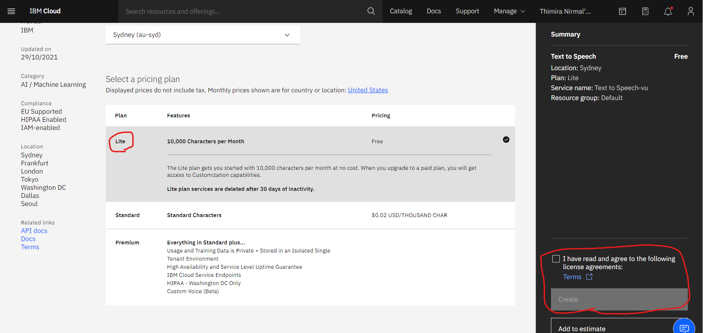
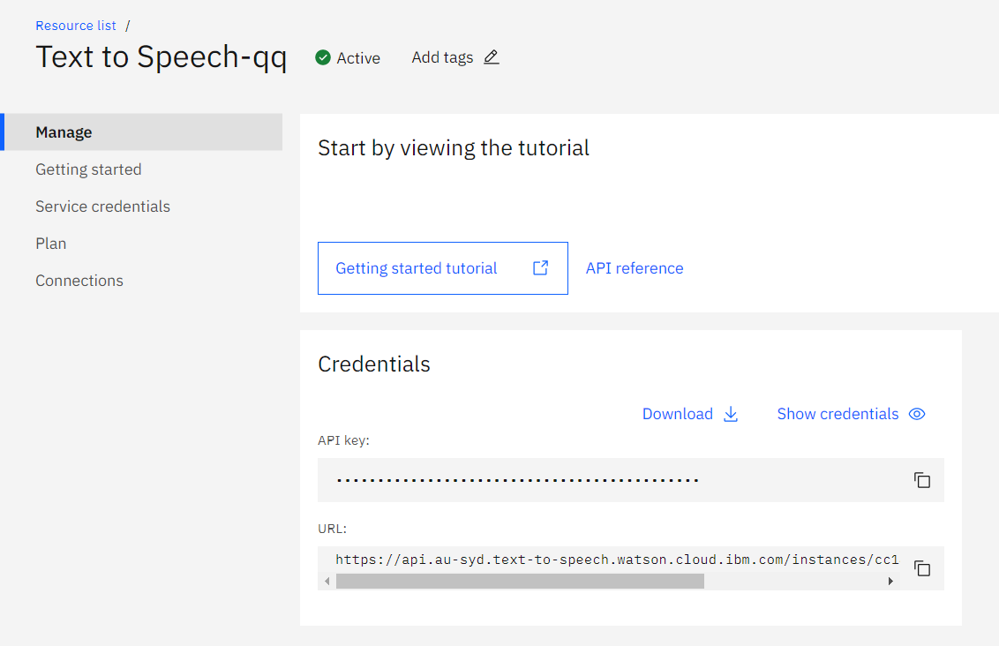

## Introduction

In this tutorial, we will use IBM Cloud to synthesize speech from text. 
By using IBM Cloud we can get natural voices.

This application can be voice-driven and screens applications, to make video narration and voice over and for voice-automated chatbots.

_**You can view thr cod ein github (tts.ipynb) [https://github.com/timnirmal/Text-to-Speech-IBM.git](https://github.com/timnirmal/Text-to-Speech-IBM.git)

Head to ttts.ipynb to see the code and open in Colab._**

**Available languages:**
Arabic, Brazilian Portuguese, Chinese (Mandarin dialect), Dutch, English (US and UK dialects), French, German, Italian, Japanese, Korean, and Spanish (Castilian, Latin American, and North American dialects).

You can view more details on [here](https://cloud.ibm.com/catalog/services/text-to-speech#about) 

Ok So, now let's start to make the application.

# Code

First we need to install the IBM Watson SDK for Python.

To do that use,
````py
!pip install ibm_watson

from ibm_watson import TextToSpeechV1
from ibm_cloud_sdk_core.authenticators import IAMAuthenticator
````

1. Then we need to goto IBM cloud and get our credentials.

[https://cloud.ibm.com/](https://cloud.ibm.com/) Follow this link and Register first if you don't have.

2. Then go to catelogure and choose Text to Speech ([https://cloud.ibm.com/catalog/services/text-to-speech](https://cloud.ibm.com/catalog/services/text-to-speech))

3. Then select light plan from that. 

This will give 10,000 Characters per Month subscription for free.



4. Then go to manage where the credentials are.



````py
URL = 'https://api.au-syd.text-to-speech.watson.cloud.ibm.com/instances/cc144'
APIkey = 'ROx'
````

In here I have deleted part of my credentials. So replace '' with your credentials.

5. Next we need to setup our service and make new tts

````py
# Setup Service
authenticator = IAMAuthenticator(APIkey)

# New TTS service
tts = TextToSpeechV1(authenticator=authenticator)
# Set service URL
tts.set_service_url(URL)
````

6. Now lets set voice for our tts.

```py
 # Set voice for tts
 voice='en-US_AllisonV3Voice'
```

7. Then use this command to write the output audio to the Speech.mp3 file

````py
with open ('./Speech.mp3','wb') as audio_file:
  getRespond = tts.synthesize('Hello World', accept='audio/mp3').get_result()
  audio_file.write(getRespond.content)
````

You can replace the text you need with 'Hello World'.

Now you can listen to the Speech.mp3 audio file.


## modify the code

This would be more usefull with a text file. So lets add one.

````py
with open('text.txt', 'r') as txt:
    text = txt.readlines()
````

This will open text.txt file and read it to text variable.

If we use `text` as command we get a output like this

````js
['Introduction\n',
 '\n',
 'In this tutorial, we will use IBM Cloud to synthesize speech from text. \n',
 'By using IBM Cloud we can get natural voices.\n',
 '\n',
 'This application can be voice-driven and screens applications, to make video narration and voice over and for voice-automated chatbots.\n',
 '\n',
 '**Available languages:**\n',
 'Arabic, Brazilian Portuguese, Chinese (Mandarin dialect), Dutch, English (US and UK dialects), ']
````

So we need to remove \n and replace it with ''.
````py
text = [line.replace('\n','') for line in text]
text = ''.join(str(line) for line in text)
````
Which will give a output like this

````js
IntroductionIn this tutorial, we will use IBM Cloud to synthesize speech from text. By using IBM Cloud we can get natural voices.This application can be voice-driven and screens applications, to make video narration and voice over and for voice-automated chatbots.**Available languages:**Arabic, Brazilian Portuguese, Chinese (Mandarin dialect), Dutch, English (US and UK dialects),
````
 
Now we can apply this text to our code. simply replace `'Hellow World'` with `text`.

````py
with open ('./Speech-text.mp3','wb') as audio_file:
  getRespond = tts.synthesize(text, accept='audio/mp3').get_result()
  audio_file.write(getRespond.content)
````


## Change Voice or Language

You can view supported languages and voice here. [https://cloud.ibm.com/docs/text-to-speech?topic=text-to-speech-voices](https://cloud.ibm.com/docs/text-to-speech?topic=text-to-speech-voices)

Chose voice and code under Voice/Gender `en-US_EmilyV3Voice`

Replace it with the `voice='en-US_AllisonV3Voice'`

Now just run the write srcipt.

````py
with open ('./Speech-emily.mp3','wb') as audio_file:
  getRespond = tts.synthesize('Hello World', accept='audio/mp3').get_result()
  audio_file.write(getRespond.content)
````