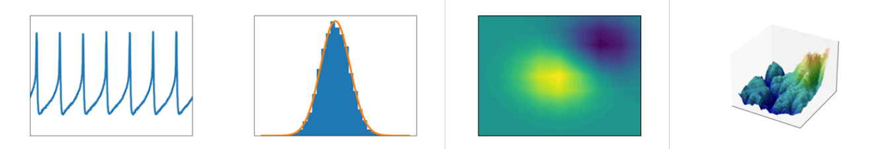
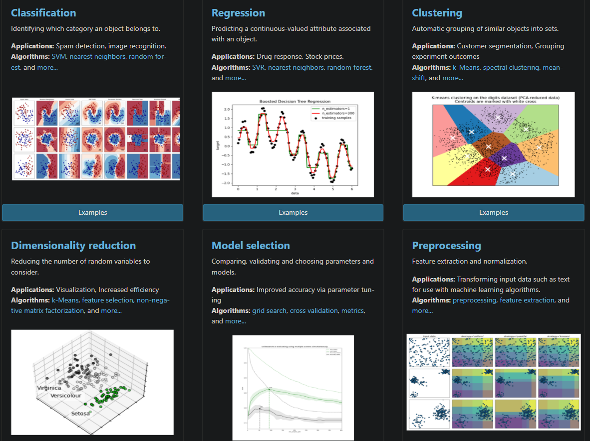
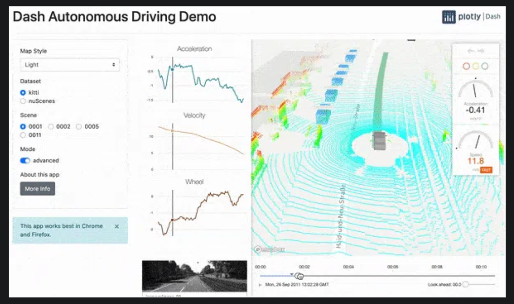
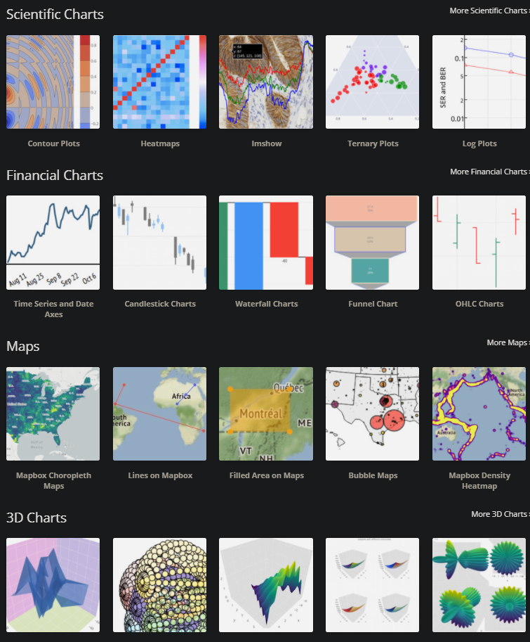
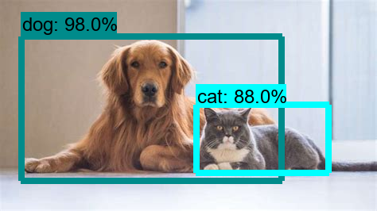
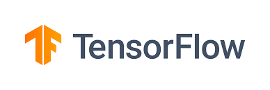
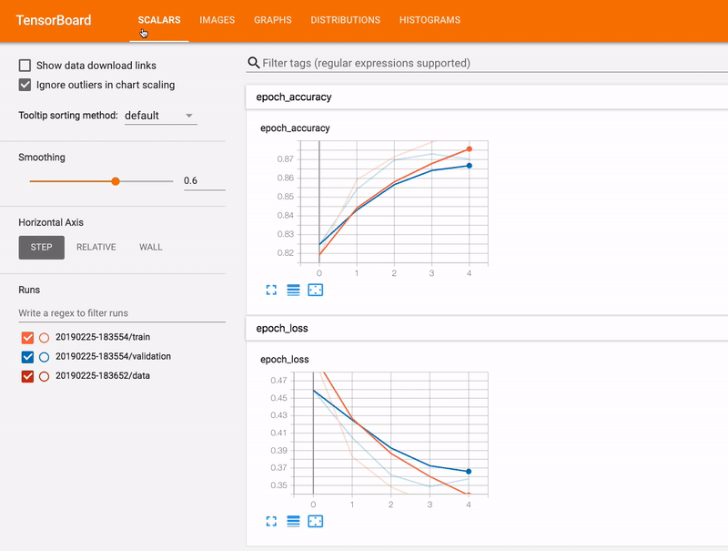
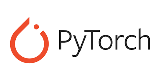

# Python Packages 

It is important to know about the Python packages that we are using in ML and Data Science.

At beginning level is might not necessary to know about the packages in detail, but it is better to have some idea on them.

## 1. PIP

pip is a package manager for Python. It is used to install and manage other [Python packages](https://pypi.org/).

After installing python you can use pip.

````shell
C:> py -m pip --version
pip X.Y.Z from ... (python 3.N.N)
````
if that's working then you have pip. To install packaged you can run below code.

````shell
C:> py -m pip install projectName
[...]
Successfully installed projectName
````

if you are using pip in python environment just use `pip install projectName` without `py -m`

To learn more about pip follow this link. [https://pip.pypa.io/en/stable/getting-started/](https://pip.pypa.io/en/stable/getting-started/)


## 2. Numpy

Numpy is a one of mostly used Python package for scientific computing. Numpy stands for Numerical Python.
It is kind of foundation of all data science and machine learning packages, an essential package for all math-intensive computations with Python like pandas and matplotlib.

Numpy provides multidimensional arrays object and masks, matrices, fast array-vector and matrix operations, linear algebra, random number generation, Fourier transforms and random data generation.
These things are very useful for data science and machine learning.

To learn more about Numpy follow this link. [https://numpy.org/](https://numpy.org/)

## 3. Pandas
Pandas is a powerful Python library for data analysis and manipulation.
It is built mostly on Numpy. Data is very important in Machine learning.

Pandas has functions for analyzing big data based on statistical theories, clean messy data, exploring, and manipulating data.

Learn more on Pandas [https://pandas.pydata.org/pandas-docs/stable/user_guide/10min.html#min](https://pandas.pydata.org/pandas-docs/stable/user_guide/10min.html#min)

## 4. Matplotlib

Matplotlib is a data visualization library for Python. It is used to plot data and images.
It can produce publication quality figures in a variety of hardtop formats and interactive environments across platforms.



Learn more on Matplotlib [https://matplotlib.org/](https://matplotlib.org/)

You can find set of examples in [here](https://matplotlib.org/stable/gallery/index.html)

## 5. Scipy
Scipy is a Python library for scientific computing. It is used to solve linear equations, optimize, and fit functions.
Even through Scipy is not commonly used as itself it helps other libraries.

It provides core mathematical methods to do the complex machine learning processes.

## 6. Scikit-learn

Scikit-learn is a Python library for machine learning. It is used to build models and train them.

It provides efficient tools for
- Classification
- Regression
- Clustering
- Model Selection
- Preprocessing (Feature Selection, Normalization)
- Dimensionality reduction

via a consistence interface in Python. This is made based on the Numpy, Scipy, Matplotlib.



Learn more on Scikit-learn [https://scikit-learn.org/stable/](https://scikit-learn.org/stable/) and [www.tutorialspoint.com/scikit_learn](https://www.tutorialspoint.com/scikit_learn/scikit_learn_introduction.htm)

## 7. Plotly

Plotly is an alternative to Matplotlib. It can do better and more beautiful, interactive data visualizations. 

It is kind of hard to start with compared to Matplotlib, and it is browser-based


Learn more on Plotly [https://plot.ly/python/](https://plot.ly/python/)

By using Dash python framework which created by creators of Plotly you can create interactive and beautiful web application with need of HTML, CSS and Javascript.



Other uses in Plotly:




## 8. OpenCV

OpenCV is a computer vision library. It is basically used to process images and videos.

- face detection
- object detection
- Text detection and recognition (ex:hand writings)
- Video analysis (ex: video stabilization)
- 3D reconstruction
- Feature extraction
- Computational photography (advanced image processing, images taken by camera)
- Shape analysis
- Optical flow algorithms (ex: track object in a video)
- Surface matching


OpenCV is written by C++ and has more than 2,500 optimized algorithms.



Learn more on OpenCV [https://opencv.org/](https://opencv.org/)


## 9. Tensorflow

TensorFlow is Google’s open source AI framework for machine learning and high performance numerical computation. And it is the most popular one out there.
Tensorflow includes many packages and tools such as tensorboard, colab, and the What-If tool.



We will learn more about Tensorflow in later articles. For now,
There are manly two method you can use tensorflow:
1. Installing locally in anaconda and use with jupyter notebook ([https://www.tensorflow.org/install](https://www.tensorflow.org/install))
2. Use google colab ([https://colab.research.google.com/notebooks/welcome.ipynb](https://colab.research.google.com/notebooks/welcome.ipynb))

Tensorflow can be either run on CPU or GPU. But if you can it is recommended to run on GPU. Otherwise, training and Evaluations will be slow. Sometimes using GPU can be speed upto 30 - 40 times. So you can understand the difference.

TensorFlow also have two version for Javascript and Mobile which is TensorFlow.js for Javascript and TensorFlow lite for Mobile.


TensorBoard provides the visualization and tooling needed for machine learning experimentation:
- Tracking and visualizing metrics such as loss and accuracy
- Visualizing the model graph (ops and layers)
- Viewing histograms of weights, biases, or other tensors as they change over time
- Projecting embeddings to a lower dimensional space
- Displaying images, text, and audio data
- Profiling TensorFlow programs




## 10. Keras

Keras is a high-level API for TensorFlow. It is a Python library for building and training neural networks. By using Keras we can rapidly build a deep learning model in a few lines of code.
So if you are beginner in machine learning, you can easily understand the concept of Keras and build neural networks by your own.

It was developed as part of the research effort of project ONEIROS
(Open-ended Neuro-Electronic Intelligent Robot Operating System).

Learn more on Keras [https://keras.io](https://keras.io/) and [https://keras.io/getting_started/](https://keras.io/getting_started/)


## 11. PyTorch

PyTorch is the main competitor of the Tensorflow. It is a deep learning framework for Python. It is developed by Facebook.
PyTorch is a deep learning framework for Python. It is a high-level API for building neural networks.

With the latest release of PyTorch, the framework provides graph-based execution, distributed training, mobile deployment, and quantization.

PyTorch supports both CPU and GPU computations and offers scalable distributed training and performance optimization in research and production.

With extensive tools and libraries, PyTorch provides plenty of resources to support development, including:

- **AllenNLP**, an open source research library designed to evaluate deep learning models for natural language processing.
- **ELF**, a game research platform that allows developers to train and test algorithms in different game environments.
- **Glow**, a machine learning compiler that enhances performance for deep learning frameworks on various hardware platforms.
- **FAISS**, allows developers to quickly search for embeddings of multimedia documents that are similar to each other.
- **Ego4D**, is a collaborative project, seeking to advance the fundamental AI research needed for multi-modal machine perception for first-person video understanding.

And they have Lists of Libraries models and Datasets which you can find out [here (https://ai.facebook.com/tools#frameworks-and-tools)](https://ai.facebook.com/tools#frameworks-and-tools)

=
Learn more on PyTorch [https://pytorch.org/](https://pytorch.org/)

