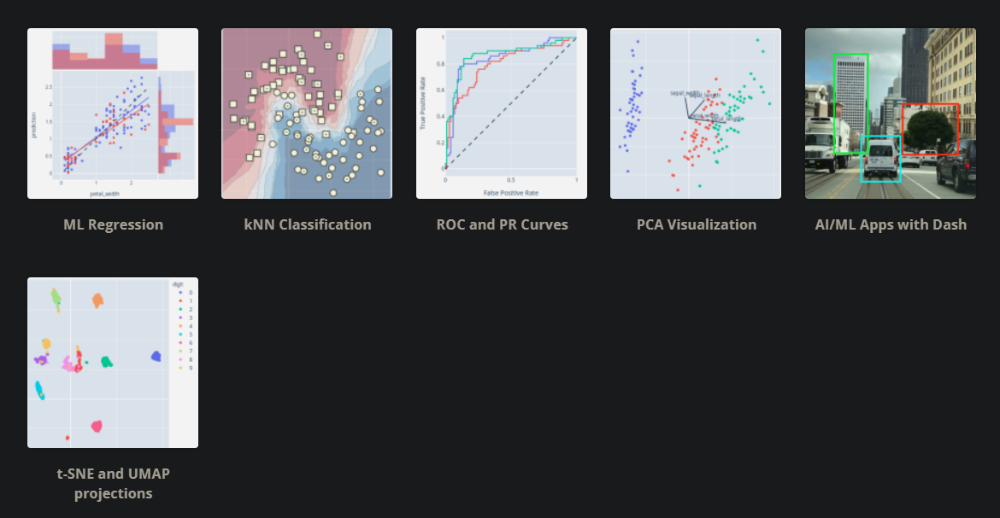

# Python Packages 

It is important to know about the Python packages that we are using in ML and Data Science.

At beginning level is might not necessary to know about the packages in detail, but it is better to have some idea on them.

## 1. PIP

pip is a package manager for Python. It is used to install and manage other [Python packages](https://pypi.org/).

After installing python you can use pip.

````shell
C:> py -m pip --version
pip X.Y.Z from ... (python 3.N.N)
````
if that's working then you have pip. To install packaged you can run below code.

````shell
C:> py -m pip install projectName
[...]
Successfully installed projectName
````

if you are using pip in python environment just use `pip install projectName` without `py -m`

To learn more about pip follow this link. [https://pip.pypa.io/en/stable/getting-started/](https://pip.pypa.io/en/stable/getting-started/)


## 2. Numpy

Numpy is a one of mostly used Python package for scientific computing. Numpy stands for Numerical Python.
It is kind of foundation of all data science and machine learning packages, an essential package for all math-intensive computations with Python like pandas and matplotlib.

Numpy provides multidimensional arrays object and masks, matrices, fast array-vector and matrix operations, linear algebra, random number generation, Fourier transforms and random data generation.
These things are very useful for data science and machine learning.

To learn more about Numpy follow this link. [https://numpy.org/](https://numpy.org/)

## 3. Pandas
Pandas is a powerful Python library for data analysis and manipulation.
It is built mostly on Numpy. Data is very important in Machine learning.

Pandas has functions for analyzing big data based on statistical theories, clean messy data, exploring, and manipulating data.

Learn more on Pandas [https://pandas.pydata.org/pandas-docs/stable/user_guide/10min.html#min](https://pandas.pydata.org/pandas-docs/stable/user_guide/10min.html#min)

## 4. Matplotlib

Matplotlib is a data visualization library for Python. It is used to plot data and images.
It can produce publication quality figures in a variety of hardtop formats and interactive environments across platforms.


Learn more on Matplotlib [https://matplotlib.org/](https://matplotlib.org/)

You can find set of examples in [here](https://matplotlib.org/stable/gallery/index.html)

## 5. Scipy
Scipy is a Python library for scientific computing. It is used to solve linear equations, optimize, and fit functions.
Even through Scipy is not commonly used as itself it helps other libraries.

It provides core mathematical methods to do the complex machine learning processes.

## 6. Scikit-learn

Scikit-learn is a Python library for machine learning. It is used to build models and train them.

It provides efficient tools for
- Classification
- Regression
- Clustering
- Model Selection
- Preprocessing (Feature Selection, Normalization)
- Dimensionality reduction

via a consistence interface in Python. This is made based on the Numpy, Scipy, Matplotlib.


Learn more on Scikit-learn [https://scikit-learn.org/stable/](https://scikit-learn.org/stable/) and [www.tutorialspoint.com/scikit_learn](https://www.tutorialspoint.com/scikit_learn/scikit_learn_introduction.htm)

## 7. Plotly

Plotly is an alternative to Matplotlib. It can do better and more beautiful, interactive data visualizations. 

It is kind of hard to start with compared to Matplotlib, and it is browser-based



Learn more on Plotly [https://plot.ly/python/](https://plot.ly/python/)

By using Dash python framework which created by creators of Plotly you can create interactive and beautiful web application with need of HTML, CSS and Javascript.


Other uses in Plotly:


