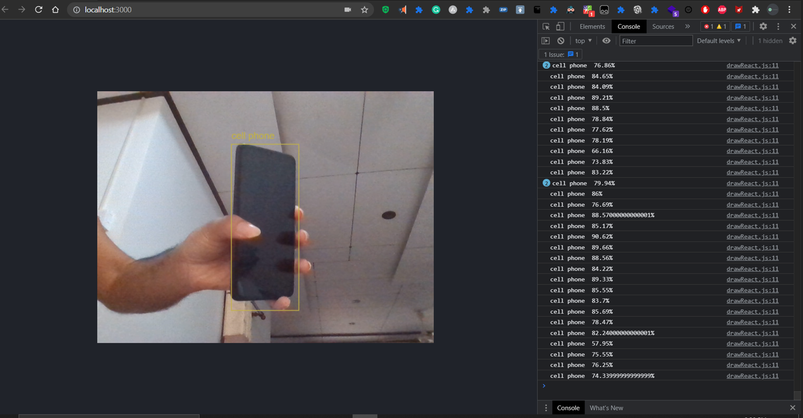

**TensorFlow** is an end-to-end open source platform for machine learning.
It has a large, flexible ecosystem of tools, libraries, and community resources that allow researchers to push the boundaries of machine learning and developers to quickly build and deploy ML-powered applications.

**TensorFlow.js** is a JavaScript library for training and deploying models in the browser and on Node.js.
And there is TensorFlow Lite, lightweight library for deploying models on mobile and embedded devices.

Before moving to further lets get familiar with TensorFlow.js by creating Object Detection App. In next part lets discuss theory parts and train our own object detection model.

## Object Detection (Classification) App with COCO-SSD + TensorFlow.js + React

For this let's use COCO-SSD, a built-in library provided by TensorFlow.
COCO-SSD stands for  Common Objects in Context — Single Shot multi-box Detection.

This model is defined in the [COCO dataset](https://cocodataset.org/#home), which is a large-scale object detection, segmentation, and captioning dataset.  

This model is capable of detecting [80 classes](https://github.com/tensorflow/tfjs-models/blob/master/coco-ssd/src/classes.ts) of objects and 
is one of the official object detection models ported to tensorflow.js. 
It can take input as any browser-based image elements (``````, ```<video>```, ```<canvas>``` elements, for example) and returns an array of bounding boxes with class name and confidence level (Fig 4).


As the returns we can see that there are bbox, class and score.
- `bbox` is number array [x, y, width, height]
- `class` is the name of the object (see what we are doing in object classification)
- `Score` is the prediction score (value between 0-1)

## Setup React App

```bash
yarn create react-app coco-ssd
```
Then install these
```bash
yarn add @tensorflow/tfjs  
yarn add @tensorflow-models/coco-ssd  
yarn add react-webcam

yarn start
```

or you can simply fork this and start. [https://github.com/timnirmal/coco-ssd-begin.git](https://github.com/timnirmal/coco-ssd-begin.git)

## Coding

You can refer finish code in needed. [https://github.com/timnirmal/coco-ssd.git](https://github.com/timnirmal/coco-ssd.git)

In App.js add this code
```js
import React, {useEffect, useRef} from "react";
import * as tf from "@tensorflow/tfjs";
import * as cocossd from "@tensorflow-models/coco-ssd";
import Webcam from "react-webcam";
import './App.css';
import {drawRect} from "./drawReact";


function App() {
    const webcamRef = useRef(null);
    const canvasRef = useRef(null);

    const detectObj = async (net) => {
        // Check data is available
        if (typeof webcamRef.current !== "undefined" &&
            webcamRef.current !== null &&
            webcamRef.current.video.readyState === 4)
        {
            // Set canvas height and width
            canvasRef.current.width = webcamRef.current.video.videoWidth;
            canvasRef.current.height = webcamRef.current.video.videoHeight;

            // Make Detections
            const obj = await net.detect(webcamRef.current.video);

            // Draw Rect
            const ctx = canvasRef.current.getContext("2d");
            drawRect(obj, ctx);
        }
    };

    const runCoco = async () => {
        const net = await cocossd.load();
        console.log("Model loaded.");
        setInterval( ()=> detectObj(net),10)
    };

    useEffect(()=>{ runCoco() },[]);

    return (
        <div className="App">
            <header className="App-header">
                Model is Loading please wait...
                <Webcam
                    ref={webcamRef}
                    muted={true}
                    style={{
                        position: "absolute",
                        marginLeft: "auto",
                        marginRight: "auto",
                        textAlign: "center",
                        width: "auto",
                        height:"auto",
                    }}
                />

                <canvas
                    ref={canvasRef}
                    style={{
                        position: "absolute",
                        marginLeft: "auto",
                        marginRight: "auto",
                        textAlign: "center"
                    }}
                />
            </header>
        </div>
    );
}

export default App;
```

Then create new file named drawReact.js in same directory and paste this code.

```js
export const drawRect = (obj, ctx) =>{
    // Loop through each prediction
    obj.forEach( prediction => {

        // Extract boxes and classes
        const [x, y, width, height] = prediction["bbox"];
        const text = prediction["class"];
        const score = prediction["score"];

        //Class & Score
        console.log(text +"  "+ score.toFixed(4)*100 + "%");
        //console.log(obj);

        // Set styling
        const color = Math.floor(score*16000000).toString(16);
        ctx.strokeStyle = '#' + color
        ctx.font = '18px Arial';

        // Draw rectangles and text
        ctx.beginPath();
        ctx.fillStyle = '#' + color
        ctx.lineWidth = 1.5;
        ctx.fillText(text, x, y-10);
        ctx.strokeRect(x, y, width, height);
    });
}
```

## Code Explain

### App.js

In here webcam is used as the source. 
A canvas is used to display the rectangles and Class name.

After importing the necessary things object detection function is defined.

    const obj = await net.detect(webcamRef.current.video);

This can be further modified by changing 
- Image mode (source)
- Maximum number of objects detected at once (Object with the highest score will be selected)
- Minimum score needed for output as detected.

````js
const obj = await net.detect(webcamRef.current.video,1,0.9);`

`//detect(img: tf.Tens`or3D | ImageData | HTMLImageElement | HTMLCanvasElement | HTMLVideoElement, maxNumBoxes?: number, minScore?: number);
````

Next let's draw rectangles with Class names and prediction score.
This will call the drawReact.js
````js
const ctx = canvasRef.current.getContext("2d");
drawRect(obj, ctx);
````

runCoco function is used to load the model and loop the Object Detecting function.

    const runCoco = async () => {
        const net = await cocossd.load();
        console.log("Model loaded.");
        setInterval( ()=> detectObj(net),10)
    };

    useEffect(()=>{ runCoco() },[]);

In return part
webCam and Canvas and their properties are defined.


### drawReact.js

`obj` is an array of objects (ex: 2 person, 1 cell phone).
by using `forEach` each object (`prediction`) is accessed.
    
    obj.forEach( prediction => {

In each object we can get 3 data.
- bbox [x, y, width, height]
- class
- score

bbox is number array containing [x, y, width, height] of the object. This is great since we can use `strokeRect` easily,
class is string (ex: person, cell phone)
score is number, and it is the prediction score (a number between 0 and 1).

we can view the object in console using,

    console.log(obj);

and print each object and their prediction score in console using,

    console.log(text +"  "+ score.toFixed(4)*100 + "%");

Then,

    const color = Math.floor(score*16000000).toString(16);

is used to generate random colors just to make fun. You can simply change it with any color you want.

        ctx.strokeStyle = '#' + color
        ctx.font = '18px Arial';
        ctx.fillText(text, x, y-10);

This code will set the font colors and display it.
The text can be changed with `ctx.fillText(text +"  "+ score.toFixed(4)*100 + "%", x, y-10);`
if you want.

        ctx.beginPath();
        ctx.fillStyle = '#' + color
        ctx.lineWidth = 1.5;
        ctx.strokeRect(x, y, width, height);

This code will set the color and line width of the rectangle and display it.

## Final



In next part let's discuss Types of machine learning models and the theories behind them with implementing them.


